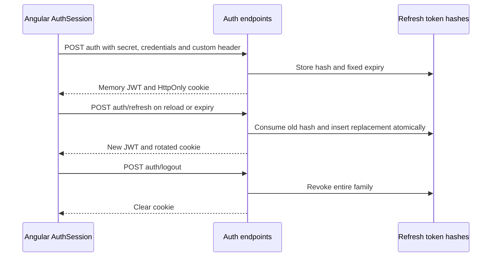

# Refresh Session Authentication

MediaShelf uses a 15-minute access JWT in memory and a backend-issued HttpOnly refresh cookie with a 30-day absolute expiry. Access JWTs are never persisted. AuthSession removes the retired localStorage token on construction. Startup POSTs `/auth/refresh` before routing; failed restoration permits public browsing.

```typescript
provideAppInitializer(() => firstValueFrom(inject(AuthSession).restore()));
```



## Contracts

- POST `/auth` and `/auth/refresh` return only `{ access_token }`. POST `/auth/logout` returns 204. Cookie responses use Cache-Control: no-store.
- Refresh tokens are opaque 256-bit values. Only SHA-256 hashes are stored. Consumed hashes remain until session expiry for replay detection. Rotation retains the original 30-day deadline. Replay revokes the entire family.
- Access JWTs include a session ID and administrator credential version. Every protected request verifies the active session on the primary database. Logout and secret rotation invalidate access and refresh credentials.
- Auth endpoints require an Origin in the explicit CORS allowlist and `X-MediaShelf-Request: 1`. Other writes require Bearer tokens; refresh cookies are not general API authorization.
- Production cookie: `__Host-media-shelf-refresh`, HttpOnly, Secure, Path=/, no Domain. Local HTTP uses a non-Secure development cookie. SameSite defaults to Lax; None is an explicit production HTTPS opt-in subject to third-party-cookie restrictions.
- The additive `catalog-v7-refresh-sessions` migration must precede deployment. Tests use isolated databases; implementation does not authorize live migration.
- The interceptor is scoped to the API boundary and bypasses auth endpoints. Simultaneous failures share one refresh; a 401 retries once, reusing another request's newer JWT when possible. A second 401 invalidates the session.
- Web Locks serialize refresh-cookie rotation across same-origin tabs when supported. Generation checks discard delayed responses after sign-out or session replacement.
- Expiry triggers refresh. Confirmed refresh rejection clears the session and redirects protected routes using existing metadata. Temporary network failures can be retried by a subsequent request.
- Logout awaits server revocation. Failed logout retains the session and displays an error; it cannot masquerade as server logout.
- Guards and protected controls remain UX boundaries. Backend guards enforce authorization.

Production should expose `/api` through the frontend origin or same-site HTTPS domains. This repository has no hosting configuration to provision a proxy. Frontend and backend must release together; old JWTs lack session IDs and are rejected.

Related lodes: [storage](../storage/summary.md), [routing](../routing/summary.md), [Kinopoisk](../gallery/kinopoisk-autofill.md), [minimal change](../minimal-change.md).
