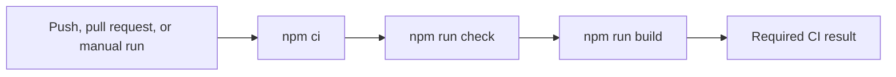

# Continuous Integration

GitHub Actions verifies every pull request targeting `master`, every push to `master`, and every manual run. The CI job uses Node.js `22.22.3`, installs the exact lockfile dependency graph with `npm ci`, runs the repository quality gate through `npm run check`, and then creates the production Angular bundle with `npm run build`. Workflow permissions are read-only, and a newer run for the same ref cancels an older in-progress run.

```yaml
jobs:
  verify:
    steps:
      - run: npm ci
      - run: npm run check
      - run: npm run build
```



Invariants:
- `.github/workflows/ci.yml` is the CI source of truth.
- CI targets `master`, the repository's default branch.
- `package-lock.json` controls installed dependency versions.
- `npm run check` must continue to include linting and the complete non-watch unit suite.
- CI must produce a production build after the quality gate passes.
- Workflow permissions remain read-only unless a future job has a documented need to write.

Related lodes: [project practices](../practices.md), [project summary](../summary.md).
