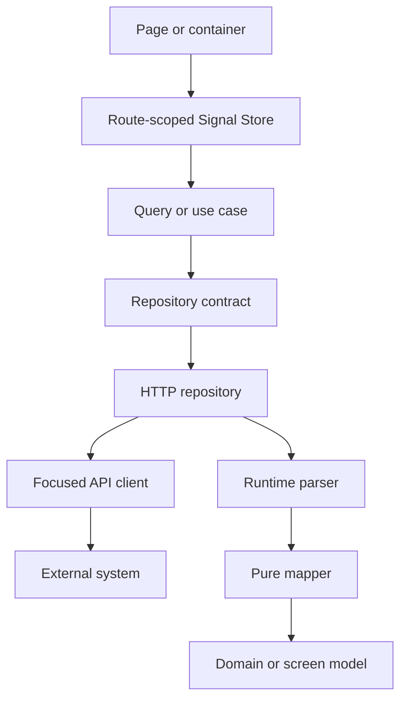
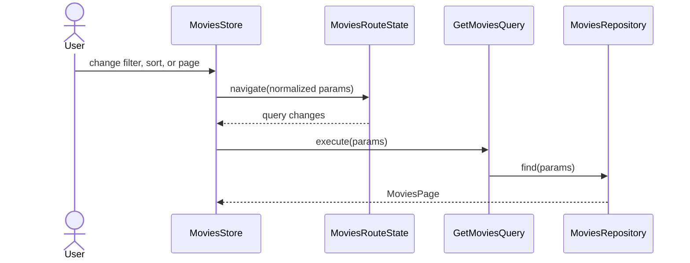

# Gallery Business Logic Architecture

Gallery follows a feature-first, layered architecture. Route pages express user intent; route-scoped NgRx Signal Stores own page state; application queries and use cases perform operations; repository contracts hide transport details; infrastructure clients perform HTTP; parsers validate `unknown` responses; pure mappers create screen-specific models.



## Dependency contract

Presentation may depend on feature state, domain models, shared UI, route adapters, and UI coordinators. It must not import `HttpClient`, API clients, DTOs, or parsers. Stores may depend on application operations, domain models, route adapters, and feedback services. Application operations may depend on repository contracts and pure domain logic, but never on Router, dialogs, translations, or toasts. Infrastructure implements repository contracts and owns HTTP, transport parsing, mapping, and transport-error normalization.

```typescript
export class GetMovieDetailsQuery {
  private readonly movies = inject(MOVIES_REPOSITORY);

  execute(id: string) {
    return this.movies.findById(id);
  }
}
```

Repository contracts are focused. There is no generic base repository, global Gallery facade, global entity cache, or one service containing every movie operation. Series and Wishlist expose independent stateless application/infrastructure slices with root repository bindings and shared normalized title data contracts; Series presentation uses scoped stores and shared catalog components while Wishlist presentation remains future work (see [Series and Wishlist foundations](series-wishlist.md)). `MOVIES_REPOSITORY` and `TITLE_AUTOFILL_REPOSITORY` are configured in the application composition root and implemented by `HttpMoviesRepository` and `HttpTitleAutofillRepository`.

## Current ownership

| Owner | Lifetime | Responsibility | Direct business dependency |
| --- | --- | --- | --- |
| `Movies` | `/gallery/movies` page | UI composition, dialogs, card navigation | `MoviesStore` |
| `MoviesStore` | Same page instance | Page data/status, deletion state, URL-driven commands | `GetMoviesQuery`, `DeleteMovieUseCase`, `MoviesRouteState`, `GalleryFeedback` |
| `MovieDetailsStore` | Detail route instance | Detail load/status, deletion reaction, return navigation | `GetMovieDetailsQuery`, `DeleteMovieUseCase`, `GalleryFeedback` |
| `MovieEditorStore` | Add/edit route instance | Mode, seed, operation invariant, retry/navigation | `LoadMovieEditorQuery`, `AutofillMovieUseCase`, `SaveMovieUseCase`, `GalleryFeedback` |
| `SeriesStore` | Series list page | URL-driven reads, list deletion and typed filter/sort/page commands | `GetSeriesQuery`, `DeleteSeriesUseCase`, `SeriesRouteState`, `GalleryFeedback` |
| `SeriesDetailsStore` | Series details page | Distinct route-ID reads, cancellation/retry and detail deletion | `GetSeriesTitleQuery`, `DeleteSeriesUseCase`, `GalleryFeedback` |
| `QuickSearchStore` | Shell search instance | Debounce, result/status/open state | `GetMoviesQuery` |
| `SettingsStore` | Application singleton | Presentation-facing catalogs/defaults | `SettingsRepository` |
| `SeriesEditorStore` | Add/edit route instance | Draft seed, single operation, retry/navigation | `GetSeriesTitleQuery`, `SaveSeriesUseCase`, `AutofillTitleUseCase`, `GalleryFeedback` |
| `DeletionConfirmation` | Application service | Dialog configuration and confirmed result | `FloatingPanel` |

The page stores remain component-provided. Navigating away destroys their state. `SettingsStore` is global because the same cached settings resource serves filters and the editor. No movie entity cache survives route changes.

## Movies list and URL state

The URL remains canonical for filtering, sorting, search, and pagination. `MoviesRouteState` is the only list-state adapter that parses and writes query parameters. Store commands navigate; the resulting route emission triggers `GetMoviesQuery`. `switchMap` cancels stale reads. Oversized pages are corrected with replacement navigation.



Routine successful reads are silent. Load failures set recoverable page state and emit error feedback. Successful explicit mutations such as delete, save, and autofill may emit localized feedback.

List deletion uses `deletingId`, so only the affected card is disabled. After success, the list removes that row and may move to the prior page. Detail deletion uses the same `DeleteMovieUseCase` but navigates to the preserved list URL. These context-specific reactions remain in their owning stores.

## Details, editor, and confirmation

`MovieDetailsStore` receives `MovieDetails`; it never sees a DTO. `SeriesEditorStore` consumes Series domain data and converts its UI draft through pure Series editor converters before existing save/autofill use cases. `MovieEditorStore` receives and saves `MovieEditorModel`; conversion to and from `MediaDto` occurs inside `HttpMoviesRepository`. The editor models one mutually exclusive operation:

```typescript
type EditorOperation = 'idle' | 'loading' | 'autofilling' | 'saving';
```

Every editor command is rejected unless the operation is `idle`, so invalid overlaps cannot be triggered by direct callers. Autofill passes a draft reader to `AutofillMovieUseCase`; when the external response arrives, its normalized `TitleAutofill` is merged into the latest draft, preserving edits made during the request.

`DeletionConfirmation.confirm()` returns an observable confirmed result. It does not receive a business callback or own mutation state. The page subscribes with its own `DestroyRef` and decides which store command to run.

## Runtime and error boundaries

All external JSON follows this path:

```text
unknown -> parser -> DTO -> pure mapper -> application/domain model
```

`MoviesApiClient` and `TitleAutofillApiClient` only construct MediaShelf HTTP requests and expose raw responses. Shared title autofill for Movie/Series/Wishlist uses `TITLE_AUTOFILL_REPOSITORY`, one normalized metadata contract, and pure latest-draft merging (see [title autofill](title-autofill.md)). Kinopoisk provider calls, DTOs, parsing and mapping belong to NestJS; the frontend validates only normalized `TitleAutofill` (see [Kinopoisk autofill](kinopoisk-autofill.md)). Repositories parse/map responses and convert failures into `AppError` kinds such as `network`, `not-found`, `unauthorized`, `forbidden`, `validation`, `conflict`, and `unexpected`. Stores and use cases do not inspect `HttpErrorResponse`.

## Extension rules

- Extend the existing `gallery/series` and `gallery/wishlist` application/infrastructure slices with component-scoped stores and lazy pages when their UI is implemented.
- Share metadata fields/parsing, collection page/parameter shapes, and query serialization. Keep the legacy Movies DTO and normalized Series/Wishlist title DTOs separate; nullability, provider IDs, formats, and PUT paths differ.
- Keep Quick Search movie-backed while Movies is the only searchable domain; introduce provider contracts only when global search spans domains.
- Add a shared entity cache only for real cross-route caching, optimistic updates, offline behavior, prefetching, or coordinated invalidation.
- Keep parsers, mappers, normalizers, comparison rules, and merge policies as ordinary pure functions.

## File map

| Concern | Current source |
| --- | --- |
| Repository contracts and operations | `src/app/features/gallery/movies/application/` |
| Feature feedback policy | `src/app/features/gallery/movies/ui/movie-feedback.ts` |
| Movies HTTP implementation | `src/app/features/gallery/movies/infrastructure/` |
| List route state and store | `src/app/features/gallery/movies/state/` |
| Details store | `src/app/features/gallery/movie-details/state/` |
| Editor store | `src/app/features/gallery/movie-editor/state/` |
| Transport parsers | `src/app/features/gallery/data-access/`, `movie-editor/data-access/` |
| Pure converters | `src/app/features/gallery/utils/`, `movie-editor/utils/` |
| Settings boundary | `src/app/core/settings/settings.store.ts`, `settings.repository.ts` |
| Application error taxonomy | `src/app/core/http/app-error.ts` |

Related lodes: [Series and Wishlist foundations](series-wishlist.md), [routing](../routing/summary.md), [media gallery](../ui/media-gallery.md), [quick search](../ui/quick-search.md), [movie details](../plans/movie-details.md), [movie editor](../plans/movie-editor.md), [settings](../settings/summary.md), [practices](../practices.md).
