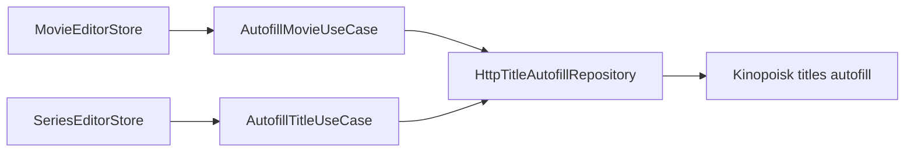

# Kinopoisk Autofill

Movie, Series and future Wishlist autofill share one authenticated endpoint, `GET /api/kinopoisk/titles/:id/autofill`, one `TitleAutofillDto`, parser, HTTP client and repository in Catalog. The redundant movie endpoint and movie transport files were removed. See [title autofill](title-autofill.md) for the provider contract.

`AutofillMovieUseCase` remains a movie-editor adapter: it reads the latest text form model when the response arrives, then `mergeMovieAutofill` converts domain metadata to strings. `AutofillTitleUseCase` merges typed title drafts, including seasons. Their different merge outputs justify separate use cases, without duplicating HTTP or provider parsing.

Movie merge rejects explicit Series metadata, retains missing metadata and preserves ID, membership date, quality and extension. Nullable numbers keep local values; zero is known metadata. Year arrays are formatted as comma-separated text. Backend IDs remain positive safe integers; the shared frontend contract uses strings.

Only the MediaShelf JWT travels from the browser. The provider key remains in the backend environment. Provider credential failures return 502 and retain the local session; backend JWT failure returns 401. Autofill does not save a collection entry.

Shared repository tests cover JWT, ID matching, invalid metadata and gateway failures; movie use-case/converter/store tests cover latest-draft merges and local file choices. Run frontend check and production build with the coordinated backend release: older movie autofill URLs no longer exist.
