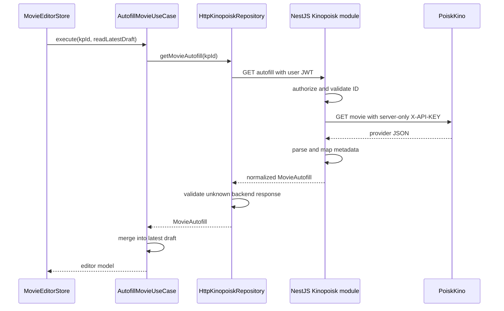

# Kinopoisk Autofill

Movie-editor autofill is a backend integration. Angular never contacts the metadata provider or stores its key. It requests `GET {apiUrl}/kinopoisk/movies/{id}/autofill` through `KinopoiskApiClient`. The existing scoped authentication interceptor attaches the user's MediaShelf JWT, and NestJS authorizes the request before validating the positive safe-integer Kinopoisk ID or calling the provider.

```typescript
getMovie(id: number): Observable<unknown> {
  return this.http.get<unknown>(`${this.environment.apiUrl.replace(/\/$/, '')}/kinopoisk/movies/${id}/autofill`);
}
```



## Ownership and contract

- Backend source: the sibling `cinema-catalogue-be/src/modules/kinopoisk/` module owns provider HTTP, timeout, provider DTOs, parsing, normalization, name/artwork fallbacks, staff filtering, and relationship mapping.
- Frontend source: `movies/infrastructure/kinopoisk/movie-autofill.parser.ts` validates the normalized backend contract. It has no provider DTOs or mapping rules. Unknown extra fields are ignored and never enter application models.
- `MovieAutofill` contains `kpId`, text/artwork fields, string arrays (`actors`, `directors`, `genres`, `countries`, `sequelsAndPrequels`, `similarMovies`), and optional numeric age rating, year, duration, and rating. Its complete definition remains in `movie-editor/models/movie-autofill.model.ts`.
- Optional provider nulls become empty strings/arrays or omitted numbers on the backend. Empty metadata retains the latest draft values through `mergeMovieAutofill`. Local `id`, `addedDate`, `quality`, and `extension` remain frontend-owned.
- `AutofillMovieUseCase` reads the current draft when the response arrives. The store's single-operation invariant prevents duplicate or overlapping autofill/save/load commands. No polling or automatic retry is introduced; each user action makes one request.
- Frontend environment objects contain only `production` and `apiUrl`. The provider key is loaded from backend `KINOPOISK_API_TOKEN` in an ignored `.env` or deployment environment. It never appears in frontend bundles, backend API responses, URLs, or forwarded error messages. Server administrators still control access to the environment.

## Errors and resource limits

The backend uses a fixed HTTPS provider host, disallows redirects, aborts after ten seconds, and bounds JSON responses to 2 MiB. It does not pass the user's JWT to the provider. Upstream 404 maps to 404; upstream credential, quota, network, malformed JSON/schema and other failures map to sanitized 502 responses; timeout maps to 504. Missing server provider configuration returns 503. Only a backend JWT rejection returns 401, avoiding unintended sign-out on upstream authentication errors.

```typescript
return this.api.getMovie(id).pipe(
  map(parseMovieAutofill),
  catchError((error: unknown) => throwError(() => toAppError(error))),
);
```

## Verification and lessons

Backend tests cover provider request headers, mapping/fallbacks, nullable metadata, malformed/mismatched IDs, oversized JSON, safe errors, timeout, missing credentials, authenticated HTTP access and credential revocation. Frontend tests cover the backend URL and JWT, absence of provider headers, normalized-response validation, error normalization and session preservation. Existing merge/store tests protect edits made while a request is pending. `npm run check`, TypeScript checking, and production build remain required.

Keys previously shipped in frontend source also exist in Git history and old deployments. Removing current source does not revoke them: rotate them at the provider and replace the server environment value. Never rewrite repository history or log key values as part of routine implementation.

Related lodes: [Gallery architecture](business-logic-architecture.md), [movie editor](../plans/movie-editor.md), [authentication](../auth/summary.md), [practices](../practices.md).
