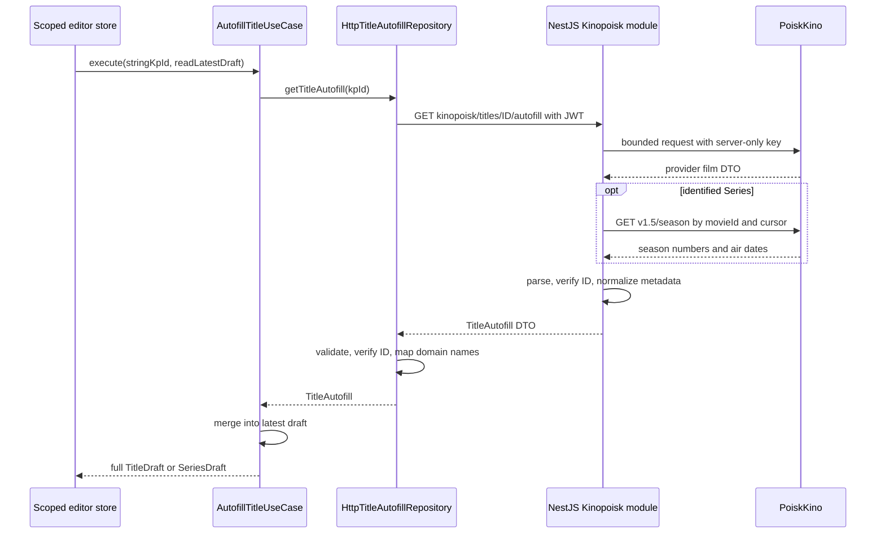

# Normalized Title Autofill

The Catalog slice provides one Kinopoisk transport for Movie, Series and future Wishlist drafts. Movie-editor text conversion remains in its own use case; all editors share `TitleAutofill`, its parser and `/kinopoisk/titles/:id/autofill`.

## Data flow



```typescript
const autofill = inject(AutofillTitleUseCase);
autofill.execute('301', () => currentDraft()).subscribe((draft) => {
  // The owning store applies draft, controls concurrent operations, and shows feedback.
});
```

## Contracts and ownership

- `catalog/application/title-autofill.repository.ts` exposes `TITLE_AUTOFILL_REPOSITORY`; `app.config.ts` binds it to `HttpTitleAutofillRepository`.
- `catalog/application/autofill-title.use-case.ts` reads the current draft only when metadata arrives. Its overload preserves a Series-only return type for Series editors; Wishlist consumes the title union.
- `catalog/infrastructure/kinopoisk/` owns the backend client and HTTP repository. The existing auth interceptor attaches only the user's MediaShelf JWT. Provider credentials and HTTP remain exclusively backend-owned.
- `catalog/models/title-autofill.dto.ts` defines the backend metadata contract. It is separate from full persisted `TitleDto`: no server entity ID, membership date, formats, or derived available count appears.
- `catalog/models/title-autofill.ts` defines the domain projection, reusing draft fields with `Omit`; domain names are `title`, `originalTitle`, `directors`, and `durationMinutes`.
- `catalog/data-access/title-autofill.parser.ts` validates unknown JSON and converts transport names. It rejects mismatched kinds/subtypes, IDs, invalid numeric/date fields, duplicate season numbers, and unsupported year values. Repository validation also rejects a returned provider ID differing from the request.
- Shared `AutofillMetadata` and `parseAutofillMetadata` own the text/array subset reused by Movie and Title autofill. Legacy numeric semantics remain distinct: optional numbers and numeric ID for Movies, explicit nullable numbers and string ID for Titles.
- Future pages/stores use these application/domain types. The Series editor consumes this foundation; Wishlist presentation remains pending.

## Backend mapping

Backend source is the sibling `cinema-catalogue-be/src/modules/kinopoisk/` module. Authenticated `GET /api/kinopoisk/titles/:id/autofill` uses the same fixed-host provider request, 10-second timeout, 2 MiB JSON bound, and sanitized errors for movie metadata. For identified Series it also queries `/v1.5/season` by movieId, selecting number and airDate with cursor pagination. Up to four pages of 250 records share a ten-second timeout; each JSON response is bounded to 2 MiB. Malformed pages, repeated cursors and excess pages fail atomically. It makes no collection writes.

Provider fields are verified against the [official OpenAPI schema](https://api.poiskkino.dev/documentation-json). `isSeries` takes priority; otherwise `tv-series`, `animated-series`, and `tv-show` identify Series, while `movie` and `cartoon` identify Movies. Missing or ambiguous type remains `kind: null`; the frontend retains the draft's kind. Explicit mismatches become an application validation error and do not apply a draft.

`releaseYears` supplies the series start/end range with `year` as start fallback. The provider uses `releaseYears.end: 0` for an unknown end; backend parsing normalizes that sentinel to null before year/range validation. Zero start/scalar years, negative ends, string years and reversed known ranges remain invalid. An unknown end with absent production status stays `unknown`, rather than inventing a finished range. Active provider release statuses (`filming`, `pre-production`, `announced`, `post-production`) map to `in_production`; `completed` maps to `finished`; an absent status plus a bounded end range also indicates `finished`. Other statuses map to `unknown`. End year is emitted only for a finished series with a known start. Series duration uses positive `seriesLength` with movie duration as fallback. A valid `premiere.world` date supplies date-only `releaseDate`; missing/invalid date strings become null.

`seasonsInfo` supplies undated known season numbers; `/v1.5/season` enriches the union with season numbers and air dates. Valid air dates fill the existing nullable `releaseYear` (exact dates are not persisted in the current season schema). Season zero is supported. Missing dates remain null; local availability, format IDs and announced totals are never inferred. Results are sorted by season number.

## Pure merge policy

`catalog/utils/title-autofill.ts` owns merge logic, independently of UI feedback or persistence:

- Non-empty provider text/arrays replace corresponding metadata; empty text/arrays retain latest draft values.
- Null numeric/date fields retain latest values. Numeric zero is preserved as a known value.
- `addedDate`, kind, title formats, and all existing local seasons remain draft-owned. Existing season availability and formats survive metadata updates; a known incoming release year replaces the local year, while null retains it.
- Incoming seasons are merged by number; absent local seasons are retained, new provider seasons become `isAvailable: false` with `formats: []`, and results are sorted by number.
- Unknown production status and announced count retain current values. An explicit active status clears a prior finished end year to keep the resulting input valid. End year cannot precede start year.
- Known series year/status updates derive the draft's writable year from merged start/end bounds; absent subtype/year information retains the existing year unchanged.
- The resulting draft passes through `toTitleWriteDto` before ordinary collection save. No provider-only fields, response IDs, or UI-only nested properties leak into backend writes.

```typescript
const draft = mergeTitleAutofill(latestDraft, normalizedMetadata);
const command: SaveTitleCommand<TitleDraft> = { mode: 'add', draft };
// Future owning store invokes the appropriate collection save operation.
```

## Verification

Backend tests mock provider HTTP and cover normalization, missing/invalid subtype fields, sanitized failures, positive ID validation, the authenticated title endpoint, and credential revocation. Frontend tests cover JWT/no-provider-key requests, metadata parsing, response-ID matching, latest-draft reads, kind mismatches, local season/format preservation, and autofill-to-Series write DTO integration. No test depends on live provider credentials; successful tests establish schema/HTTP contract behavior rather than live upstream availability.

Related lodes: [movie editor autofill](kinopoisk-autofill.md), [Series/Wishlist foundations](series-wishlist.md), [Gallery architecture](business-logic-architecture.md), [authentication](../auth/summary.md), [movie editor](../plans/movie-editor.md).
