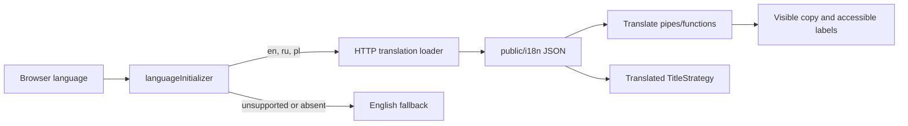

# Internationalization

MediaShelf uses ngx-translate v18 with its HTTP loader. English, Russian, and Polish dictionaries live at `public/i18n/<lang>.json` and have identical nested key structures. `languageInitializer` registers supported languages, selects the browser language when it is `en`, `ru`, or `pl`, falls back to English otherwise, synchronizes the document `lang` attribute, and waits for the selected dictionary before application startup completes.

```typescript
export const languageInitializer = (): Promise<unknown> => {
  const translate = inject(TranslateService);
  const browserLanguage = translate.getBrowserLang()?.split('-')[0];
  const language = isSupportedLanguage(browserLanguage) ? browserLanguage : 'en';
  return firstValueFrom(translate.use(language));
};
```



Invariants:

- Supported runtime languages are exactly `en`, `ru`, and `pl`; English is the fallback.
- Translation files use nested contextual keys and preserve the same leaf-key set in every language.
- Visible interface copy, accessibility labels, navigation labels, and route document titles use translation keys.
- API content such as movie names, directors, and genres remains source data and is not translated by the UI layer.
- Route metadata stores title and navigation translation keys; `TranslatedTitleStrategy` resolves document titles.
- Shared components accept semantic translation keys when their copy is supplied by a feature.
- Tests use an in-memory English loader and verify dictionary key parity.

Related lodes: [project summary](../summary.md), [practices](../practices.md), [routing](../routing/summary.md), [media gallery](../ui/media-gallery.md).
