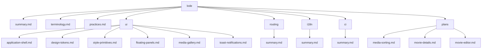

# Lode Map

- [summary.md](summary.md) - Current project snapshot and design-token entrypoint.
- [terminology.md](terminology.md) - Project vocabulary for tokens, themes, and media UI concepts.
- [practices.md](practices.md) - Current engineering and styling practices.
- [ui/summary.md](ui/summary.md) - UI architecture overview.
- [ui/application-shell.md](ui/application-shell.md) - Responsive header, main outlet, footer, and version contract.
- [ui/design-tokens.md](ui/design-tokens.md) - Global CSS design-token contract.
- [ui/style-primitives.md](ui/style-primitives.md) - Reusable Bootstrap-like button, typography, and form class contract.
- [ui/floating-panels.md](ui/floating-panels.md) - Dynamic native-dialog infrastructure, typed data/results, lifecycle, and responsive placement.
- [ui/media-gallery.md](ui/media-gallery.md) - Movies grid, media-card, poster fallback, and pagination contract.
- [ui/toast-notifications.md](ui/toast-notifications.md) - Global toast store, viewport, variants, timers, accessibility, and animations.
- [routing/summary.md](routing/summary.md) - Root URL contract and lazy feature boundaries.
- [i18n/summary.md](i18n/summary.md) - Runtime language initialization, translation resources, and key contracts.
- [ci/summary.md](ci/summary.md) - GitHub Actions quality gate and production build contract.
- [plans/media-sorting.md](plans/media-sorting.md) - Responsive, URL-backed Movies sorting contract and structure.
- [plans/movie-details.md](plans/movie-details.md) - Movie details route, API/store flow, prototype adaptation, components, navigation, and verification contract.
- [plans/movie-editor.md](plans/movie-editor.md) - Movie add/edit routes, Signal Form and store flow, Kinopoisk autofill, CRUD mutations, confirmation deletion, and verification contract.
- `plans/` - Persistent roadmaps and TODOs when needed.
- `tmp/` - Git-ignored session scraps and handovers.

```scss
@use 'styles/tokens';
```



Related lodes: [summary](summary.md), [UI tokens](ui/design-tokens.md), [toast notifications](ui/toast-notifications.md), [routing](routing/summary.md), [CI](ci/summary.md), [media sorting plan](plans/media-sorting.md), [movie details plan](plans/movie-details.md), [movie editor plan](plans/movie-editor.md).
