# Lode Map

- [summary.md](summary.md) - Current project snapshot and design-token entrypoint.
- [terminology.md](terminology.md) - Project vocabulary for tokens, themes, and media UI concepts.
- [practices.md](practices.md) - Current engineering and styling practices.
- [minimal-change.md](minimal-change.md) - User-required investigation, complexity control, diff review, and completion policy for future work.
- [ui/summary.md](ui/summary.md) - UI architecture overview.
- [ui/application-shell.md](ui/application-shell.md) - Responsive header, main outlet, footer, and version contract.
- [ui/design-tokens.md](ui/design-tokens.md) - Global CSS design-token contract.
- [ui/style-primitives.md](ui/style-primitives.md) - Reusable Bootstrap-like button, typography, and form class contract.
- [ui/floating-panels.md](ui/floating-panels.md) - Dynamic native-dialog infrastructure, typed data/results, lifecycle, and responsive placement.
- [ui/media-gallery.md](ui/media-gallery.md) - Movies grid, media-card, poster fallback, and pagination contract.
- [ui/quick-search.md](ui/quick-search.md) - Debounced header catalog preview, result navigation, and Enter-to-list contract.
- [ui/toast-notifications.md](ui/toast-notifications.md) - Global toast store, viewport, variants, timers, accessibility, and animations.
- [routing/summary.md](routing/summary.md) - Root URL contract and lazy feature boundaries.
- [i18n/summary.md](i18n/summary.md) - Runtime language initialization, translation resources, and key contracts.
- [ci/summary.md](ci/summary.md) - GitHub Actions quality gate and production build contract.
- [auth/summary.md](auth/summary.md) - Persisted JWT session, authorization dialog, interceptor, guarded routes, and protected-control contract.
- [storage/summary.md](storage/summary.md) - Guarded localStorage wrapper and centralized token/language key contract.
- [settings/summary.md](settings/summary.md) - Validated app-wide settings resource, backend-owned catalogs, defaults, and Gallery consumers.
- [gallery/kinopoisk-autofill.md](gallery/kinopoisk-autofill.md) - Authenticated backend autofill, server-only provider key, normalized contract, limits and error handling.
- [gallery/title-autofill.md](gallery/title-autofill.md) - Normalized Kinopoisk Series/Wishlist metadata, latest-draft merging, local season preservation, and save contracts.
- [gallery/business-logic-architecture.md](gallery/business-logic-architecture.md) - Current layered Gallery dependency contract, state ownership, workflows, runtime boundaries, and extension rules.
- [gallery/series-wishlist.md](gallery/series-wishlist.md) - Callable Series/Wishlist API foundations, normalized title contracts, promotion, and future presentation boundaries.
- [plans/media-sorting.md](plans/media-sorting.md) - Responsive, URL-backed Movies sorting contract and structure.
- [plans/movie-details.md](plans/movie-details.md) - Movie details route, API/store flow, prototype adaptation, components, navigation, and verification contract.
- [plans/movie-editor.md](plans/movie-editor.md) - Movie add/edit routes, Signal Form and store flow, Kinopoisk autofill, CRUD mutations, confirmation deletion, and verification contract.
- [plans/series-viewing.md](plans/series-viewing.md) - Series list/details implementation, reusable presentation, URL flow, season metadata, accessibility, and episode-count limitation.
- [plans/series-editor.md](plans/series-editor.md) - Series add/edit/delete UI, shared editor sections, single season quality selections, derived availability/quality lists and verification.
- `plans/` - Persistent roadmaps and TODOs when needed.
- `tmp/` - Git-ignored session scraps and handovers.

```scss
@use 'styles/tokens';
```

```mermaid
flowchart TD
  Root[lode] --> Summary[summary.md]
  Root --> Terms[terminology.md]
  Root --> Practices[practices.md]
  Root --> MinimalChange[minimal-change.md]
  Root --> UI[ui]
  UI --> UIShell[application-shell.md]
  UI --> UITokens[design-tokens.md]
  UI --> UIPrimitives[style-primitives.md]
  UI --> FloatingPanels[floating-panels.md]
  UI --> MediaGallery[media-gallery.md]
  UI --> QuickSearch[quick-search.md]
  UI --> Toasts[toast-notifications.md]
  Root --> Routing[routing]
  Routing --> RouteSummary[summary.md]
  Root --> I18n[i18n]
  I18n --> I18nSummary[summary.md]
  Root --> CI[ci]
  CI --> CISummary[summary.md]
  Root --> Auth[auth]
  Auth --> AuthSummary[summary.md]
  Root --> Storage[storage]
  Storage --> StorageSummary[summary.md]
  Root --> Settings[settings]
  Settings --> SettingsSummary[summary.md]
  Root --> Gallery[gallery]
  Gallery --> TitleAutofill[title-autofill.md]
  Gallery --> KinopoiskAutofill[kinopoisk-autofill.md]
  Gallery --> SeriesWishlist[series-wishlist.md]
  Gallery --> GalleryArchitecture[business-logic-architecture.md]
  Root --> Plans[plans]
  Plans --> MediaSorting[media-sorting.md]
  Plans --> MovieDetails[movie-details.md]
  Plans --> MovieEditor[movie-editor.md]
  Plans --> SeriesViewing[series-viewing.md]
```



Related lodes: [summary](summary.md), [Gallery business logic](gallery/business-logic-architecture.md), [authentication](auth/summary.md), [browser storage](storage/summary.md), [settings resource](settings/summary.md), [UI tokens](ui/design-tokens.md), [quick search](ui/quick-search.md), [toast notifications](ui/toast-notifications.md), [routing](routing/summary.md), [CI](ci/summary.md), [media sorting plan](plans/media-sorting.md), [movie details plan](plans/movie-details.md), [movie editor plan](plans/movie-editor.md).
