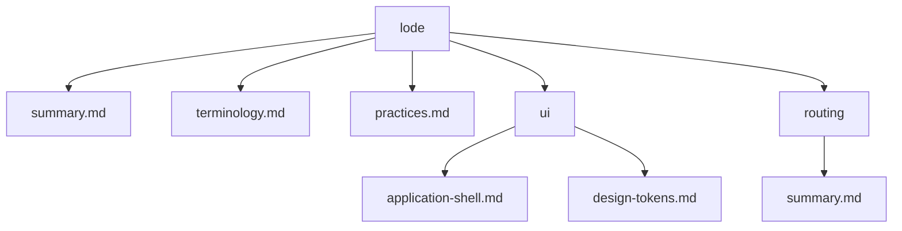

# Lode Map

- [summary.md](summary.md) - Current project snapshot and design-token entrypoint.
- [terminology.md](terminology.md) - Project vocabulary for tokens, themes, and media UI concepts.
- [practices.md](practices.md) - Current engineering and styling practices.
- [ui/summary.md](ui/summary.md) - UI architecture overview.
- [ui/application-shell.md](ui/application-shell.md) - Responsive header, main outlet, footer, and version contract.
- [ui/design-tokens.md](ui/design-tokens.md) - Global CSS design-token contract.
- [routing/summary.md](routing/summary.md) - Root URL contract and lazy feature boundaries.
- `plans/` - Persistent roadmaps and TODOs when needed.
- `tmp/` - Git-ignored session scraps and handovers.

```scss
@use 'styles/tokens';
```



Related lodes: [summary](summary.md), [UI tokens](ui/design-tokens.md), [routing](routing/summary.md).
