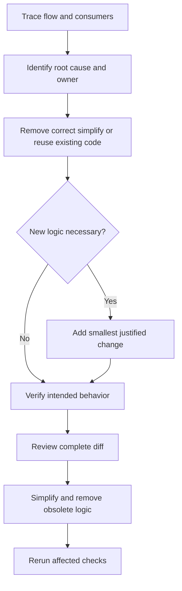

# Minimal Change and Complexity Control

User-supplied engineering policy for this and future work. Prefer modifying, simplifying, or removing existing code over adding code. Solve the underlying problem with the smallest maintainable change that respects the current architecture. This preference permits justified architectural changes; it does not justify preserving a broken design.

## Investigation and preference order

Before implementation, trace execution/data flow, inspect consumers/dependencies, and search for established utilities, services, stores, and patterns. Identify the owning layer and root cause before designing a workaround.

Evaluate solutions in this order:

1. Remove incorrect or unnecessary code.
2. Correct existing implementation.
3. Simplify or consolidate existing logic.
4. Reuse an established project abstraction.
5. Introduce new logic only when the preceding options are insufficient.

Avoid compensating layers: forwarding wrappers/facades, coordinators without a real UI responsibility, auxiliary booleans, duplicate validation, fallback chains, extra subscriptions/events, imperative refreshes for broken reactive flows, or unsupported compatibility branches. Preserve module/dependency boundaries, Angular reactivity, and SignalStore ownership. Do not introduce parallel state or redundant synchronization.

Keep changes relevant to the cause. Preserve public contracts unless a necessary change is explicitly justified. No unrelated refactoring or abstractions for hypothetical requirements. Add focused tests for intended observable behavior.

```typescript
// Commands update the canonical URL; its emission performs the read.
applySorting(sorting: CatalogSorting): void {
  routeState.navigate({ ...store.params(), ...sorting, currentPage: 0 });
}
// Do not also load here: that duplicates the route-driven request.
```

The example illustrates ownership rather than prescribing a new abstraction or bypassing existing no-op checks.



## Mandatory review and completion

After implementation, review the complete diff internally:

- Can the behavior use fewer changes?
- Does new logic compensate for an existing design flaw?
- Can any new function, variable, service, or abstraction be removed?
- Is existing functionality duplicated?
- Did independent state variables increase unnecessarily?
- Is every new conditional necessary?
- Was obsolete or superseded code left behind?
- Does the solution fix the cause or hide a symptom?

Simplify safely, then rerun affected tests. Completion requires the underlying problem resolved, expected behavior verified, boundaries preserved, unnecessary complexity avoided, obsolete logic safely removed, and only justified changes in the final diff. Passing tests alone are insufficient evidence.

Related lodes: [practices](practices.md), [Gallery architecture](gallery/business-logic-architecture.md), [Series viewing plan](plans/series-viewing.md).
