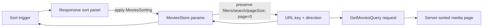

# Media Sorting

The Movies request carries `key` and `direction` from URL query parameters through `MoviesRouteState`, `MoviesStore`, and `GetMoviesQuery` to the Movies repository. A responsive sorting control changes server-side ordering without introducing client-side sorting. The URL is canonical, so refresh, deep links, history, filters, and pagination stay synchronized.

```typescript
export const SORTING_DIRECTIONS = ['asc', 'desc'] as const;
export type SortingDirection = (typeof SORTING_DIRECTIONS)[number];

export const SORTING_KEYS = ['addedDate', 'ageRating', 'enName', 'name', 'quality', 'rating', 'year'] as const;
export type SortingKey = (typeof SORTING_KEYS)[number];

export type MoviesSorting = {
  readonly direction: SortingDirection;
  readonly key: SortingKey;
};
```



## Contracts and decisions

- `addedDate desc` remains the default; absent or invalid URL values resolve to that pair in memory without rewriting a clean initial URL.
- An applied sort always has both a key and direction. There is no unsorted state.
- Applying a different sort preserves all filter/search parameters and `pageSize`, resets `currentPage` to `0`, and navigates with the complete normalized query parameter object.
- The backend remains authoritative for ordering. The frontend never sorts only the currently loaded page.
- `SORTING_DIRECTIONS` and `SORTING_KEYS` are exported gallery-domain constants and are the single runtime allow-lists used by URL parsing and sort UI option generation.
- Keep the exact server values: `addedDate`, `ageRating`, `enName`, `name`, `quality`, `rating`, and `year`; `enName` is presented as Name and `name` as Russian name.
- The trigger is rendered between Filters and Add movie. Its closed label is `Sort by: <field>`; `aria-expanded="true"` adds the primary border and rotates the supplied chevron icon upward.
- The supplied `9 × 14` chevron lives at `/icons/sort-chevron.svg`, is exposed through the shared `Icon` union, and rotates in CSS instead of duplicating up/down chevron files.
- `Icon` preserves the chevron's intrinsic 9:14 aspect ratio when scaling it, so `NgOptimizedImage` does not distort the glyph or report an image-ratio warning.
- Ascending and Descending use explicit arrow-up and arrow-down assets through `Icon`; placeholder rectangles or font glyphs are not used. The mobile trigger and panel heading use the sort asset.
- Styling composes existing typography, spacing, surface, primary, border, radius, elevation, focus, and motion tokens; component SCSS does not hard-code attachment colors.
- Visual styling follows the sorting-specific Stitch export: the desktop menu is 18rem wide with compact 36px rows, `body-sm` option names, 11px code-style hints/footer copy, abbreviated localized Asc/Desc labels, an 8px radius, and Level-3 elevation. The mobile sheet restores `title-md` option names, full direction labels, 40px segmented controls, a 12px top radius, and safe-area footer padding.
- Sort field descriptions are direction-aware (`Oldest`/`Newest`, `A → Z`/`Z → A`, low/high rating, quality, age rating, and year). Avoid a hard-coded current year in translations; use stable descriptive copy or compute a year in TypeScript if the product later requires numeric endpoints.

## Responsive interaction

- Desktop/tablet: open an anchored popover beneath the trigger, aligned to its end edge and clamped to the viewport. Direction or field changes apply immediately while the popover remains open; Reset to Default immediately applies `addedDate desc`. Escape or backdrop dismissal closes it and restores trigger focus.
- Scrolling outside the open sort panel dismisses it and restores trigger focus, preventing the anchored menu from becoming visually detached. Scroll events originating inside the mobile sheet remain available for its independently scrollable option list.
- Mobile: use the attachment's modal bottom sheet with scrim, drag-handle decoration, title/close header, direction segmented control, radio-style field list, Current badge, and persistent full-width Apply Sorting action. Changes remain draft-only until Apply; close/Escape discards them, and Reset returns the draft to `addedDate desc`.
- The shared floating-panel contract owns an `anchored-responsive` placement, keeping global overlay lifecycle out of the feature. It accepts the trigger element as an anchor, uses a transparent backdrop and anchored dimensions above the mobile breakpoint, and switches to a bottom-aligned, content-height modal sheet with scrim and safe-area padding on mobile.
- The sheet body scrolls independently when vertical space is limited. All controls retain at least the project standard touch target and visible focus treatment.
- Use native buttons, fieldsets, and radio semantics (or equivalent `aria-pressed`/`aria-checked` contracts). The trigger exposes `aria-haspopup="dialog"`, `aria-expanded`, and an accessible current-sort label; the panel has an `aria-labelledby` title, selected state is not color-only, and focus is restored on close.

## Implementation structure

1. `models/sorting-direction.ts`, `models/sorting-key.ts`, and `models/movies-sorting.ts` own the shared values and types.
2. `MoviesStore.sorting` projects the applied pair and `applySorting` owns normalized route navigation.
3. `FloatingPanelConfig`, `FloatingPanelContainer`, and shared panel styles own anchor positioning and responsive sheet placement.
4. `IconName` and `public/icons/` own the chevron, arrows, and sort glyph.
5. `MoviesSortSelect` owns the trigger and dynamic panel lifecycle; `MoviesSortPanel` owns direction/key selection and responsive commit behavior. Neither presentation component knows about routing or HTTP.
6. `movies.sorting.*` translation keys remain structurally identical in English, Russian, and Polish.

## Verification contract

- Params tests accept every exported direction/key and retain invalid-value fallback behavior.
- Store tests prove sort changes preserve filters/search/page size, reset page zero, and avoid redundant navigation.
- Sort panel tests cover desktop immediate emission, mobile draft/application, selection state, and reset.
- Trigger and floating-panel tests cover accessible expanded state, anchored placement, dismissal, cleanup, and focus restoration.
- Translation parity, `npm run check`, and the production build are required quality gates.

Related lodes: [media gallery](../ui/media-gallery.md), [floating panels](../ui/floating-panels.md), [design tokens](../ui/design-tokens.md), [practices](../practices.md), [terminology](../terminology.md).
