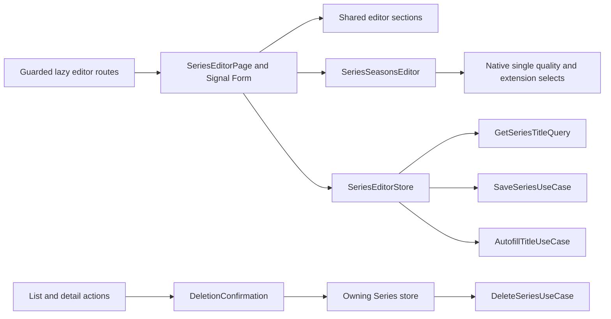

# Series Editor and Deletion

Series library writes use authenticated lazy routes `/gallery/series/new` and `/gallery/series/:id/edit`, with static editor routes preceding the public `series/:id` route. List cards and details expose authenticated Edit/Delete; the list exposes an Add series button with the shared add icon and a sign-in hint when disabled. Write controls enable reactively on sign-in; card Edit/Delete disable only when signed out or deletion is in flight. These routes preserve list query parameters and do not add Gallery navigation tabs.

## Ownership and reusable presentation

`SeriesEditorPage` owns the writable Signal Form draft, validation and UI events. `SeriesEditorStore` owns mode, requested ID, loaded seed, load errors and one operation (`idle | loading | saving | autofilling`). Reads use `GetSeriesTitleQuery`; writes use `SaveSeriesUseCase`; metadata uses `AutofillTitleUseCase`. Existing repositories retain HTTP, runtime parsing and DTO conversion responsibilities.

Common Movie/Series sections live in `gallery/catalog/components/editor/`. Basic Information, Classification & Metrics, Artwork Assets, Production & Cast and Relationships & Universe receive narrow `EditorFields` subsets rather than a whole Movie form. Movie-specific release-year markup is projected into Basic Information. Movie scalar local-file controls remain Movie-owned. The section shell and responsive workspace/card SCSS are reused directly; there is no shared CRUD framework or smart base page. Section components have no stores, transport or routing dependencies.

`SeriesSeasonsEditor` owns repeated row presentation and emits add/remove intents. Page transformations update the canonical draft immutably. Row keys remain UI-only, survive ordinary typing and autofill, and never appear in writes. The row loop tracks Signal Forms field identity directly; evaluating old field values in a track expression can reference orphaned fields after autofill replaces the array. Adding a row focuses its first input after rendering; removing a row focuses Add season.

```typescript
// The owning store selects the existing application command.
const command: SaveTitleCommand<SeriesDraft> = mode === 'add'
  ? { mode: 'add', draft }
  : { mode: 'edit', id, draft };
saveSeries.execute(command);
```



## Series fields and write invariants

- Start/end year, production status, announced season count, release date and added date are editable. Unknown optional metadata stays nullable; Movie's stricter legacy required-field policy is not copied.
- Name rejects whitespace-only values; added date is required. Populated dates, provider IDs, numeric ranges and integer counts are validated. Provider IDs remain strings, including safe integer values beyond Movie's legacy limit.
- An end year requires a finished series, a start year and an ordered range. `year` is derived from those bounds: equal start/end years serialize as a scalar (2022), distinct bounds as an array ([2022, 2025]), and an unknown start as null. Both series bounds remain intact. Unknown read-end markers become a writable start year rather than null elements in a write array. Backend year arrays must contain distinct values.
- Seasons edit unique season numbers (including zero for specials), nullable release year, local availability and format pairs. “Number of series” currently means season number. Episode counts are absent from the owning backend/frontend contract and require a separately agreed contract/persistence change before implementation.
- Available-season count is computed live from the current season checkboxes in both add and edit. It is displayed as text, has no form field or duplicate store state, and is omitted from writes. The backend also derives the persisted response count.
- Pure converters build a complete `SeriesDraft`, derive title formats from season selections, preserve hidden compact artwork/release metadata, normalize text lists, and omit IDs, response counts and UI row keys. Existing infrastructure converts the draft to the full replacement PUT DTO.

## Formats and settings

Each season uses the same native `.form-control` select pattern as Movie Edit for one quality and one extension. Settings IDs are persisted; titles/values label options. Manually added seasons leave quality, extension and availability unset. Newly autofilled seasons start available and use backend-marked default quality/extension IDs from settings at response time; missing defaults remain blank. Existing season selections, including unchecked availability, survive repeated autofill. Existing inactive IDs remain visible using their ID as a label. Quality and extension selects appear only when Available in library is checked, and both are required in that state. Unchecked seasons hide both controls and skip their required validation. Hidden selections may remain in the local draft for rechecking, but unchecked seasons contribute no formats to saved season/title data or quality summaries.

Section 5, Local File & Physical Stream, displays a read-only, deduplicated quality list derived only from available season selections. There is no independent title-format editor. Full writes derive the title's unique quality/extension pairs from the seasons and write zero or one pair per season. When loading legacy multi-format seasons, the first existing pair initializes the single choice; saving applies this single-choice contract.

## Requests and navigation

- New route IDs cancel stale reads and in-flight editor commands before clearing their old seed. Busy state is derived from one operation value; duplicate save/autofill commands are ignored.
- Autofill reads the latest draft at response time, uses the existing pure merge, fills season numbers and known release years while preserving existing availability/quality/extension, initializes newly imported rows from settings defaults as available, and maintains row identities. Errors or kind mismatches apply no partial draft.
- Save errors/conflicts retain the form and current screen. Success shows localized feedback and navigates to the returned Series detail ID with preserved query parameters.
- Discard navigates to the Series list on add and current Series details on edit, including direct links. Browser unload/route-deactivation guards are outside this scope.
- Invalid submissions mark errors touched and focus the first field through Signal Forms' error summary; duplicate-season errors focus the season error region.

## Shared deletion

`catalog/ui/DeletionConfirmation` is shared with Movies. It configures Series/Movie translated copy, prevents overlapping dialogs and returns only confirmed outcomes. Existing `ConfirmationDialog`/`FloatingPanel` retain native modality, Escape/backdrop dismissal, non-destructive initial focus, focus restoration and owner cleanup. No business callbacks or mutation state enter the confirmation service.

Pages call the owning Series store only after confirmation. Stores call `DeleteSeriesUseCase`, guard duplicate commands and show feedback through shared `GalleryFeedback`. List success removes the item/decrements the total; deleting the final item on a later page navigates the canonical URL backward once. An overlapping read is cancelled and replaced so stale data cannot restore a deleted item. Detail success returns to the Series list only if still displaying the deleted ID; failure retains the current screen/data.

## Appearance, accessibility and verification

The desktop/mobile HTML prototypes supply workspace/card/artwork composition. Their `screen.png` files contain failed-fetch text, so actual screenshots are verified from the running application. The editor reuses semantic tokens, native controls, the existing shell and responsive two-column/stacked layouts; no draft action, entity switcher, live media-card preview or external UI library is introduced.

Labels, error associations, visible focus, translated EN/RU/PL feedback, progress announcements and query-preserving breadcrumbs belong to the UI contract. Shared breadcrumb text uses a surface foreground token with contrast in both themes; the primary fill token is unsuitable for small text on dark surfaces.

Focused tests cover complete conversion, single season selections and derived title formats, static routes/authentication, stale requests, duplicate commands, save failures, derived count and quality list, focus and deletion outcomes. Required checks are `npm run check`, `npx tsc --noEmit -p tsconfig.app.json`, production build, mocked browser CRUD and desktop/mobile AXE/overflow audits. Mocked browser tests establish UI behavior and request shape; live backend integration remains separate.

Related lodes: [minimal change](../minimal-change.md), [Movie editor](movie-editor.md), [Series viewing](series-viewing.md), [Series/Wishlist contracts](../gallery/series-wishlist.md), [title autofill](../gallery/title-autofill.md), [architecture](../gallery/business-logic-architecture.md), [settings](../settings/summary.md), [floating panels](../ui/floating-panels.md).
