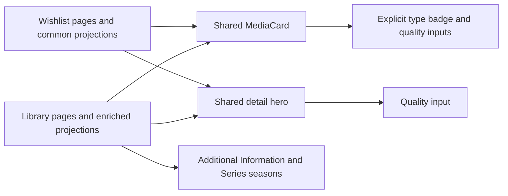

# Collection Viewing Presentation

The simplified design belongs only to Wishlist. Movies and Series library views retain their previous metadata and sections. All three collections continue to share presentational components and URL-backed filters/sorting/pagination.

## Display contract

| View | Library Movies | Library Series | Wishlist Movie/Series |
| --- | --- | --- | --- |
| Card type badge | Hidden | Hidden | MOVIE or SERIES |
| Card quality | Shown when known | Available-season quality labels | Hidden |
| Card seasons | None | Available/recorded count | Hidden |
| Detail quality | Shown when known | Available-season quality labels | Hidden |
| Additional Information | Added date, quality, extension | Added/release dates and formats | Omitted |
| Detail seasons | None | Season table and available/recorded/announced counts | Omitted |
| Production/Cast and related titles | Retained | Retained | Retained |

## Component boundaries

- `MediaCard.showTypeBadge` defaults to false; `showQuality` defaults to true. Optional `MediaCardModel.quality` preserves structural compatibility with both legacy library and normalized Wishlist projections. The existing `card-overlay-metadata` slot supplies Series library season counts.
- Wishlist sets `showTypeBadge=true` and `showQuality=false`; it projects Series production status/year without season counts. Library lists use the defaults.
- `MovieDetailsHero.showQuality` defaults to true. Wishlist sets it to false. Library details compose their Additional Information/season sections; Wishlist never composes those sections.
- `TitleDetailsView` accepts optional quality and added date. Wishlist `toTitleCard`/`toTitleDetailsView` return common nullable metadata without quality/settings reads. Series library projections resolve available-season quality from Settings and include added date.
- `movie-details__cards--library` selects the original 7/5 desktop detail split, stacking at tablet widths. Wishlist keeps its single full-width Production and Cast section.
- Kind determines media metadata; collection pages own navigation and actions. Wishlist uses Wishlist routes for either kind and retains provider import/refresh/delete/library-transfer behavior.

```html
<!-- Wishlist card: explicit presentation; library pages use defaults. -->
<msh-media-card [media]="card.media" [showTypeBadge]="true" [showQuality]="false" />
<!-- Wishlist details hide quality; its page omits extra library sections. -->
<msh-movie-details-hero [movie]="view" [showQuality]="false" [actions]="[]" />
```



## Invariants and verification

Presentation scope must not be inferred from title kind: both library and Wishlist contain Series. Keep Wishlist-specific exclusions explicit at its page boundary. Hidden fields remain in domain/editor/save/autofill contracts. Type badge/quality switches preserve existing action events and authentication protection.

Tests verify library quality and season counts, restored library detail sections, Wishlist type badges, suppressed Wishlist quality even when supplied, normalized nullability and available-season format projection. Browser checks compare all collections in light/dark themes at desktop/mobile widths with full default AXE and overflow checks. Build, lint, strict TypeScript and all unit tests are required gates.

Related lodes: [Series viewing](series-viewing.md), [Movie details](movie-details.md), [Wishlist viewing](wishlist-viewing.md), [Wishlist provider workflow](wishlist-provider-workflow.md), [Media gallery](../ui/media-gallery.md), [Minimal change](../minimal-change.md).
