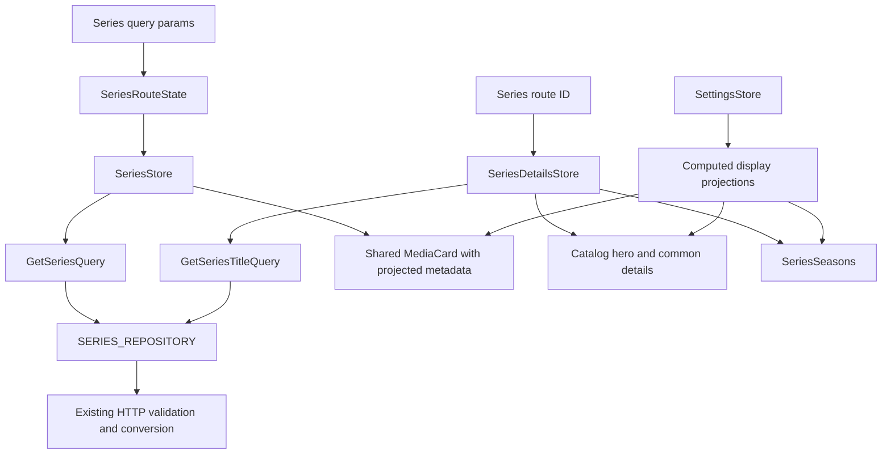

# Series Viewing

Series viewing is implemented at public lazy routes `/gallery/series` and `/gallery/series/:id`. Existing stateless `GetSeriesQuery` and `GetSeriesTitleQuery` supply validated `SeriesTitle` domain data; repositories, API clients, DTO parsers and normalized title contracts retain their responsibilities. Wishlist presentation remains separate from Series viewing and writing. Series cards expose View and authenticated Edit/Delete; the list exposes Add. Write behavior is documented in [Series editor](series-editor.md). Header Quick Search retains its Movies contract.

The visual hierarchy follows workspace-root `stitch-gallery/code.html` and `stitch-movie-view/code.html`, using existing SCSS tokens/primitives rather than prototype Tailwind or mock telemetry. Both prototype `screen.png` files contain failed-fetch text; the HTML is the usable reference.

## Ownership and reuse

| Owner | Responsibility |
| --- | --- |
| `series/pages/series.ts` | Collection page, settings-dependent computed card projections, filter dialog and View navigation. |
| `series/state/series-route-state.ts` | Typed Catalog URL parsing/writing, with no independent writable state. |
| `series/state/series.store.ts` | Latest normalized params, server titles/count and finite read status; URL-driven reads and page/filter/sort commands. |
| `series/pages/series-details.ts` | Breadcrumbs, computed details projection, shared sections and post-render heading focus. |
| `series/state/series-details.store.ts` | Route-ID reads, clearing stale content, cancellation, retry and finite read status. |
| `series/components/series-seasons.ts` | Sorted season rows, availability/year/format presentation and labelled table scroll region. |
| `catalog/components/` | Filter/sort controls, detail hero, production/cast and related-name lists consumed by Movies and Series. |
| `catalog/utils/title-display.ts` | Pure year, artwork, nullable metadata and format display projection. |
| `utils/collection-params.ts`, `collection-filters.ts`, `collection-filter-chips.ts` | Shared pure URL parsing, filter transformations and chip projection. |
| Shared UI | Business-agnostic `MediaCard`, badges, ratings, page header/status, empty state, detail card and pager. |

Reusable components retain their existing Movie-prefixed classes, selectors and inputs to preserve consumer contracts. Their Gallery catalog location expresses multi-collection ownership. They choose neither repositories nor store behavior. The Hero accepts a nullable `TitleDetailsView`; production/cast and related lists accept narrow structural subsets. Movie-only Additional Information retains its legacy quality/extension presentation; Series composes `DetailCard` with normalized format pairs.

List/detail layout SCSS is shared through `catalog/components/collection-list.scss` and `title-details.scss`. There are no duplicate Movie/Series layout implementations, generic CRUD/store frameworks, facades, entity caches, or imperative synchronization layers. The current project enforces Core/Shared/Layout/Feature dependency direction; no Nx infrastructure is introduced.

## URL and state contracts

Catalog defaults are page zero, 20 records, added date descending. Sorting accepts exactly `CATALOG_SORTING_KEYS`: `addedDate`, `ageRating`, `enName`, `kpId`, `movieLength`, `name`, `rating`, `year`. Quality/extension sorting is unsupported. Movies retains its separate supported keys through the typed `readMoviesParams` entrypoint, with the same default sorting.

```typescript
export function readCatalogParams(params: ParamMap): CatalogParams {
  return readCollectionParams(params, CATALOG_SORTING_KEYS, DEFAULT_CATALOG_PARAMS);
}

// Commands navigate; only the resulting URL emission requests a page.
applyFilters(filters: CollectionFilters): void {
  route.navigate(replaceCollectionFilters(store.params(), filters));
}
```

- URL owns filters, sorting, search, zero-based page index and page size. Route emissions are deduplicated after normalization. Page commands translate the one-based pager index once.
- Shared filters support genres, bounded year range, minimum rating, age, quality values, actors and directors. Production/availability filtering has no backend parameter contract and is not exposed.
- Filter and sorting changes reset page zero. Other changes preserve search. Oversized page indexes are corrected through replacement navigation to the last valid server page.
- The Series toolbar has no page-size selector or page-size change command. Pagination uses the existing request page-size contract (20 by default).
- Series and Movies default to added-date sorting in descending order, including sorting reset. Series supplies its supported keys and reset defaults to the shared sorting controls. Filter UI uses typed Reactive Forms; its signal projection derives from form value changes, and its year bounds match the URL parser.
- Each Series store has one `idle | loading | loaded | error` status. The store owns source data; cards and format labels are computed, never stored as synchronized copies.
- Replaceable reads use `rxMethod`/`switchMap`. Changing detail ID clears old content. Failed reads render a retryable error; an empty collection differs from filtered no matches. Routine successful reads are silent.
- Leaving a page destroys its store and subscriptions. Deep links require no cached list. View, breadcrumbs and browser history preserve collection query parameters.



## Display invariants

- `productionStatus` remains `unknown | in_production | finished`. Unknown status is labelled explicitly and never inferred from dates.
- Release ranges use Series start/end years. A known finished range is `2018–2023`; a known ongoing start is `2022–present`; unknown end/status shows the supplied start only; unknown start shows localized Unknown. No current-year or legacy metadata fallback chain.
- `seasons.length` means recorded seasons, `announcedSeasonCount` means announced seasons, and backend `availableSeasonCount` means available seasons. Cards always show production status and available/recorded counts; details also show a known announced count. No maximum-season-number inference, client availability recount, or invented announced rows.
- Season zero is valid and labelled Specials. Table rows are sorted without mutating domain arrays. Availability comes from `isAvailable` independently of formats. Unknown year and absent format pairs have distinct empty text. Empty season arrays render an explicit message while known announced counts remain visible.
- Unknown rating/age/duration remain null and optional badges are omitted. Zero rating and age remain valid. Display projections never widen legacy `Media` into nullable domain data.
- Format IDs resolve against settings option IDs. Labels use quality titles and extension values. Unknown catalog IDs display Unknown format in detail rows; no IDs are fabricated or used as filter values. Only pairs on available seasons contribute format labels. Unavailable rows show no formats even when legacy API data retains them.
- Card quality aggregates deduplicated labels only from available-season formats. Detail format summaries use the same deduplicated available-season pairs; stale top-level pairs are ignored. Unknown/unresolved quality badges are omitted. Settings changes recompute labels without reloading Series data.
- Card artwork prefers compact poster, then full poster, then the local placeholder. Details use the full poster/placeholder. Dynamic image failures use established fallbacks. The backdrop is decorative.
- Kinopoisk links require a known rating and provider ID; string IDs are preserved, and links announce a new tab and use safe `rel`. Rating without an ID is plain text. Duration is never presented as whole-series runtime.
- Related title arrays remain non-clickable strings. Empty related blocks are hidden. Series uses “Similar titles”; Movies retains its existing heading. Actor/director/country collections show supplied names only.

Episode counts are not present in `SeriesSeason`, its DTO, or the inspected backend season contract. The table does not invent them. If episodes per season are required, define a nullable validated field at the owning backend/schema/API boundary and extend frontend parsing/conversion plus write/autofill preservation in a focused follow-up.

## Accessibility and verification

New/adapted components use explicit OnPush, signal inputs/outputs/computed projections, `inject()`, native template control flow, strict types and the existing lazy boundaries. Runtime text is synchronized in English, Russian and Polish. Static artwork uses the established optimized-image infrastructure; dynamic poster/backdrop fallbacks retain normal image error handling.

Page headings accept programmatic focus. Series list focuses its header on initial rendering, details focuses the heading when the requested title arrives, and focus rings use semantic tokens. Breadcrumbs identify the current page; seasons have scoped column/row headers and a uniquely labelled keyboard-reachable scroll region. Counts/status/availability do not depend on color. Desktop keeps the prototype's 7/5 detail split; narrower layouts stack and reflow. Card status/counts are always visible; touch overlay and reduced-motion rules live in the card component so encapsulation cannot override them.

Shared shell corrections required by browser checks are owned at their source: search input omits unsupported `aria-expanded`, muted light-theme text has sufficient contrast, Gallery/filter/sort text uses theme-aware selection colors, pagination label uses readable shell text, and mobile header controls reserve their actual width while navigation can scroll.

Focused Vitest coverage is colocated with Series stores/pages/seasons, display projections, shared cards and adapted filters/sorting. Existing Movie tests cover regressions. Browser validation uses mocked API/settings data and checks full default AXE rules, runtime errors, preserved query navigation, heading focus, touch controls and page overflow across 1440/390/320 widths, light/dark themes, populated/empty/unknown/error states and filter/sort dialogs. These checks establish UI behavior, not live backend connectivity.

Quality gates are `npm run check`, strict application/spec TypeScript checks and `npm run build`. Apply the [minimal-change review](../minimal-change.md) to the complete diff, remove obsolete implementations and rerun affected checks after simplification. Preserve unrelated staged work.

Related lodes: [Series foundations](../gallery/series-wishlist.md), [Gallery architecture](../gallery/business-logic-architecture.md), [media gallery](../ui/media-gallery.md), [movie details](movie-details.md), [settings](../settings/summary.md), [routing](../routing/summary.md), [minimal-change practice](../minimal-change.md).
