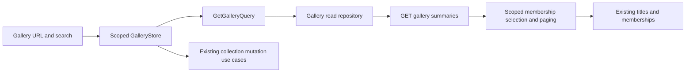

# Unified Gallery List

Status: implemented. Gallery read contracts, combined page, routing and global search are complete. Existing collection pages and full APIs remain unchanged. No schema migration was added or applied.

## Outcome and current findings

`/gallery` becomes the default combined list of library Movies, library Series and Wishlist titles. Existing collection lists, details and editors remain available. Root and wildcard redirects already target Gallery; its empty child currently redirects to Movies and must become a real list route.

The backend already stores all kinds in `titles`, with `library_entries` and `wishlist_entries` for membership. A new content table, copied catalogue or frontend merge of three independently paginated APIs is unnecessary. Collection-aware server selection must apply filtering, sorting, count and pagination to the entire result set.

Current Movie lists return full MediaDto fields. Series/Wishlist lists call TitleReader.readMany, fetching descriptive fields, formats, subtype data, all seasons and season formats. Cards and header previews consume only a subset; a small list DTO can avoid that hydration. Full details/editor DTOs remain necessary and separate.

QuickSearchStore currently calls GetMoviesQuery, shows six results after a 300 ms debounce, routes every result to Movies and allows Enter only after nonempty successful previews. Combined search needs a common read query, collection-aware result links and Enter independent of preview completion.



## Mandatory compatibility boundary

Gallery is additive. Existing Movies, Series and Wishlist lists, details, editors and provider workflows must keep their current page appearance and functionality: cards, badges, quality/season presentation, toolbars, dialogs, filters, sorting, pagination, validation, mutations, toasts and collection-specific navigation.

- Keep existing endpoints, default DTOs, repository/query contracts and stores. Do not move existing collection lists to Gallery summaries or add a summary mode to their endpoints in this implementation.
- Use compact summaries only for the new Gallery and the explicitly requested global search extension. Optimization of existing collection responses remains an analysis finding and separate future work.
- Scope new badges, collection/kind filters and styling to Gallery/search. Shared component additions must be opt-in with existing defaults; they must not alter existing pages or shared CSS behavior.
- Keep existing detail/editor breadcrumbs, labels, cancel/save/delete navigation and layouts. Gallery View/Edit opens the established routes and workflows; browser Back returns to the original Gallery URL. Do not add Gallery-specific return controls or rewrite existing page behavior.
- The intended shared changes are the new All items navigation entry, Gallery as the default landing page, and global search across all collections with Enter opening Gallery. Existing collection URLs remain directly accessible and functional.
- Capture existing-page browser baselines before implementation and verify them afterward. Changes to the shared navigation/search surface are expected; changes inside existing collection pages are regressions.

## Identity, badges and membership

- Keep `id` as the internal title ID and `kpId` as a nullable canonical provider ID. Never deduplicate separate historical titles by kpId.
- Each combined card displays a Movie or Series badge. Wishlist membership gets an additional Wishlist badge, so wishlisted movies and series retain their actual media type.
- Add a validated `collection: 'movies' | 'series' | 'wishlist'` discriminator to list summaries. Library kind determines Movies/Series; Wishlist retains its kind.
- Gallery defaults to one card per title ID. If historical data contains both memberships, use Library as the effective collection and its added date; do not change the stored memberships to enforce presentation deduplication.
- An explicitly Wishlist-only query must still show every Wishlist member. Library priority applies when its collection is included in the requested scope; otherwise Wishlist wins. Define the scope before choosing the effective row and counting results.
- Collection identity determines actions and navigation, never title text or the presence of season fields. Unknown kind/invalid combinations fail transport parsing rather than guessing a mutation target.

| Effective collection | View | Secondary action | Delete |
| --- | --- | --- | --- |
| Movies | `/gallery/movies/:id` | Edit at `/gallery/movies/:id/edit` | Existing DeleteMovieUseCase |
| Series | `/gallery/series/:id` | Edit at `/gallery/series/:id/edit` | Existing DeleteSeriesUseCase |
| Wishlist, either kind | `/gallery/wishlist/:id` | Existing RefreshWishlistUseCase with id and kpId | Existing DeleteWishlistUseCase |

View is public. Edit/Refresh/Delete use the existing authenticated control policy. Disable Refresh when kpId is absent. Shared deletion confirmation uses the correct collection copy. Track pending mutations per title ID; failures retain the card and report feedback. No new Gallery mutation API is needed.

## Backend read contract

Add a focused GalleryModule/Controller/Service and a database-owned compact list reader. Export only the necessary shared reader boundary; preserve constructor injection, validated unknown input and existing error handling. Register the module in AppModule.

`GET /api/gallery` is public and returns `{ list, totalCount, currentPage }`. It always returns summaries, never full Title DTOs. Pagination is zero-based; page size is 1–100, matching current validation. The FE uses its existing default page size and addedDate descending.

| Query | Contract |
| --- | --- |
| `collections` | Optional repeated/comma-separated Movies/Series/Wishlist values; absent means all; normalize, deduplicate and reject unknown values |
| `kinds` | Optional `movie,series` media-type selection, independent of Wishlist membership |
| `search` | Existing normalized title-name substring semantics across the selected collections |
| `genres, quality, ageRating, rating` | Existing filter meanings, using backend catalogue values rather than display labels |
| `actors, directors, fromYear, toYear` | Existing people and release-year matching; ignore unknown/null year markers rather than casting them into calendar years |
| `key, direction` | Common keys: addedDate, ageRating, enName, kpId, movieLength, name, rating, year; asc/desc only |
| `currentPage, pageSize` | Existing validated paging limits and safe offset multiplication |

Search retains NFKC/lowercase normalization and literal escaping of `%`, `_` and backslash. Extend the searched collections without silently introducing actor/description/full-text search semantics. Search and filters are combined by AND. Known numeric zero remains valid. Quality matches title formats or available Series season formats using existing indexed EXISTS predicates; unknown Wishlist quality does not match a selected quality filter.

Use explicit sort SQL from an allowlist, effective membership date for addedDate, numeric provider-ID ordering, consistent first-known/start-year semantics, nulls last in both directions for the new Gallery only, and internal ID as a deterministic tie-breaker. Verify the cost of null ordering in query plans instead of promising index-only scans. Movie-only quality/extension sorting remains available on its existing endpoint; it is not offered on the combined list.

```json
{
  "list": [{
    "id": "title-id", "collection": "wishlist", "kind": "series",
    "kpId": "12935736", "name": "Универ. 17 лет спустя", "enName": "",
    "addedDate": "2026-10-10", "year": null, "rating": null,
    "ageRating": null, "movieLength": null, "posterUrl": "",
    "compactPosterUrl": "", "genres": [], "director": [], "qualityValues": [],
    "series": {
      "startYear": null, "endYear": null, "productionStatus": "unknown",
      "availableSeasonCount": 0, "recordedSeasonCount": 0
    }
  }],
  "totalCount": 1, "currentPage": 0
}
```

Define immutable Summary DTO/domain types with Pick/Omit for shared metadata and explicit list-only fields, rather than Partial<Title> or a fake complete Title. A Movie summary has `series: null`; a Series summary requires its compact subtype. Read-year null markers remain supported. Quality values can map to titles through Settings; formatting and translated labels belong to FE projections.

## Database selection and optional migration

1. Select from current titles and membership tables. Prototype a scoped UNION ALL of Library and Wishlist-only rows with an anti-join for titles already represented in the selected Library scope. Compare it with an equivalent titles-led EXISTS plan; choose the measured simpler/faster query.
2. Reuse exactly the same scope/filter predicate for count and page selection. Count and page summaries use one read transaction/snapshot. Select IDs and sort columns before projecting card fields; limit relation work to the selected page.
3. Do not call the full TitleReader for compact responses. Read explicit metadata columns, Series production/year fields and small aggregate counts/quality values in bounded batches. Do not join multiple many-to-many relations into the page query and multiply rows before LIMIT.
4. Keep current primary/replica routing and post-write replica synchronization. Mutation results can update a card immediately; follow-up list reads must respect existing replica freshness/fallback behavior.
5. Inspect current titles_name, titles_rating, titles_name_search, kind/sort indexes, library_added, wishlist_added and relation indexes. No schema migration is required for correctness.
6. Benchmark mixed-kind datasets and both sort directions using EXPLAIN QUERY PLAN. Only add proven missing indexes, such as a matching global year expression/order index, if measurements justify them. Do not add every possible compound index, duplicate prefix indexes blindly or denormalize membership dates into titles.
7. If needed, ship one additive migration after the current ledger, preserving IDs, membership, foreign keys and provider conflicts. Use isolated fixtures and verify upgrade/idempotency/rollback. The previous approval covered v8 only; a future live migration requires its own approval, backup and schema verification.

Query-plan inspection identifies index use and temporary sorting, but its textual output is not a stable application contract. See [SQLite EXPLAIN QUERY PLAN](https://www.sqlite.org/eqp.html) and [query planning](https://www.sqlite.org/queryplanner.html). Substring search is not guaranteed to become an indexed lookup simply because name_search has an index; benchmark it with realistic matches.

## List payload analysis and scoped optimization

Full entity metadata is unnecessary for listing. Exclude description, backdrop, countries, cast, relationships, complete seasons, episode data, individual format IDs and editor-only fields from summary responses. Retain directors and genres because cards/previews display them, plus counts/quality summaries needed by Gallery cards and search previews. Existing collection responses are unchanged in this implementation.

- Gallery and Quick Search use the compact `/api/gallery` endpoint immediately.
- Keep Movies/Series/Wishlist collection lists on their existing endpoints and full responses. Their repositories, query return types, stores and projections remain unchanged. Details, editors, Wishlist-to-library prefill and mutation result parsers also keep their full DTOs.
- Record the potential benefit of compact existing-list responses, but defer that migration to a separately scoped task with compatibility and visual verification.
- Share the summary parser and projection logic. Do not silently hydrate missing fields, cast summaries to Title/MediaDto, add per-card GET requests or download all seasons just to count them.
- Wishlist Refresh still returns its existing full Title. Convert that successful result into the card summary, then reconcile the current Gallery server page for changed sorting/filter membership. The existing Wishlist page refresh workflow remains unchanged; Gallery does not need a new mutation endpoint.
- Compare equivalent 30-item responses, DB statement count, transferred JSON bytes and parsing time before/after. Add a fixture with many seasons and prove summary payload size does not grow with the complete season graph. Gallery projections preserve the meaning of existing Series count/quality data, including specials; existing Series presentation is unchanged.

## Frontend application contracts, before page work

Add a focused read slice under `gallery/catalog/`: GalleryListItem/GalleryParams models, Gallery repository contract, GetGalleryQuery, compact response parser and HTTP implementation/client. This read contract represents a real cross-collection capability; it is not a generic CRUD facade. Bind its repository at the composition root.

Reuse CollectionPage, common parameter/filter serialization, runtime metadata validators, AppError, feedback, Settings and card primitives. Extend pure URL parsing for Gallery-only collections/kinds without adding these fields to unrelated editor DTOs. Canonicalize enum order so equivalent URLs do not trigger duplicate requests. Reset page zero on query/filter/sort changes; preserve search while changing filters. Clear filters leaves search intact; clearing search leaves filters intact.

Keep route state and presentation in a component-scoped GalleryStore. It owns summaries, status, totals and pending item IDs. Reuse focused mutation use cases selected by collection. Avoid another entity cache, global mutable service, generic repository base or separate dispatcher facade. Commands change the canonical URL; its emission performs the read. Post-mutation reconciliation is an explicit refresh of that same read, not duplicate navigation plus loading.

Use the existing Observable repository/query contract and rxMethod/switchMap cancellation for the combined list and debounced preview. This reuses the established architecture and avoids introducing two request-state owners. Lode prefers httpResource for new signal-derived HTTP reads; adopting that model requires a deliberate application-boundary adaptation rather than exposing raw HTTP/DTO state to pages. Do not add a parallel resource/cache or migrate unrelated stores as part of this list feature. Cover cancellation and request deduplication before page implementation.

## Gallery page, routing and navigation

After backend and application contracts pass their tests, add the lazy Gallery list page at the empty child of GalleryLayout. Remove the redirect to Movies; root and wildcard continue to target `/gallery`. Keep every existing collection/detail/editor URL.

- Subnavigation becomes All items, Movies, Series, Wishlist. Update GALLERY_NAVIGATION_ITEMS so a navigation entry with empty path is included and maps to `/gallery`, rather than being dropped by the current truthiness filter.
- All items uses exact RouterLinkActive matching; it must not remain active on Movies/Series/Wishlist detail routes. Other tabs keep their current nested-route behavior.
- Compose existing PageHeader, MediaCard, filter/sort controls, filter chips, Pagination, loading/error/retry and EmptyState with shared collection SCSS and design tokens.
- Show Movie/Series badges on every combined card, and an additional Wishlist badge for Wishlist cards. Preserve current quality/production/count display where applicable. Add only an opt-in presentation slot/input needed for the collection badge, preserving all existing defaults and styles; shared cards receive no repositories or feature mutation logic.
- Support the common existing filter controls. Keep collection/media-kind URL scopes supported without displaying scope selectors on the page.
- Use the global header search without a duplicate Gallery search form, as requested. Preserve the existing responsive header behavior.
- Add controls, if exposed on the combined toolbar, reuse existing Add movie/Add series routes and WishlistAddDialog. Do not invent a combined editor.
- Open established collection detail/editor URLs without modifying their breadcrumbs, return buttons or navigation policies. Browser Back restores the Gallery URL and its filter/sort/page state. Forward only compatible existing query parameters; Gallery-only scope parameters stay on Gallery.
- Keep Gallery-only state out of collection HTTP filters and write DTOs. Existing editor saves, discard actions and detail deletion continue to navigate as before.

## Global search

Switch QuickSearchStore from GetMoviesQuery to GetGalleryQuery with all collections, page zero, six results and common defaults. Keep the 300 ms debounce, immediate loading state, cancellation, empty/reset behavior and poster fallback. It uses the same compact DTO and matching predicate as the list.

Preview links use the collection route table above and the existing supported search query parameter, without introducing new return behavior on destination pages. Display kind and Wishlist membership badges, nullable years/ratings and current quality presentation without inventing unknown values. Preserve native keyboard-operable links.

Pressing Enter in the search field with any trimmed nonblank query navigates to `/gallery?search=...`, resets page/filter state to defaults and closes the flyout, even while preview is loading, empty or failed. Blank input does not navigate. Enter on a focused result link still opens that result. Update canApply, footer/status copy and navigation tests to remove the old successful-nonempty-preview restriction.

## Implementation order and acceptance gates

1. Capture existing-page visual/behavior baselines; finalize Gallery summary/query contracts and membership precedence. Mark existing collection contracts and stores as compatibility boundaries.
2. Implement backend read selection/compact projection and the new Gallery endpoint, preserving all existing collection endpoints. Profile SQL and add a migration only if justified.
3. Implement the separate Gallery FE models/parsers/repository/query without changing existing collection list consumers. Verify runtime boundaries and mutation-to-summary conversion. This completes the business-logic gate.
4. Implement the Gallery page/store and lazy route, navigation badges/actions, URL filters/sorting and browser Back restoration.
5. Extend global search; make Gallery the default page.
6. Review the complete diff per minimal-change.md, remove obsolete Movie-only search assumptions, update current Lode documentation and run final checks.

Backend acceptance: mixed kinds/memberships; duplicate historical kpIds preserved; dual memberships counted once in combined scope; Wishlist-only scope; global ordering/pagination; nulls/zero values; Unicode/literal wildcard search; every supported filter and their combinations; quality availability; concurrent snapshot consistency; invalid query rejection; stable IDs; bounded statements/payload; unchanged existing full-list/detail/editor contracts and query semantics; optional migration safety. Use temporary local DBs and mocked providers.

Frontend acceptance: existing Movies/Series/Wishlist CRUD, refresh, provider prefill, filters, sorting, pagination, routes and visible page content work as before; root/default and tab activation; URL deep links/reload/back-forward; all action routes and auth states; per-ID pending protection; confirmation; refresh resort/filter reconciliation and delete last-page correction; failed mutations retain data; no per-card detail reads; successful/error/empty/loading search previews; Enter before preview completion and with no matches; native result-link keyboard behavior; Gallery history restoration; existing collection navigation policies; synchronized English/Polish/Russian copy.

Run BE typecheck, lint:check, build and tests; FE check, production build and strict spec typecheck. Run mocked browser flows at 320px and desktop in both themes, focus/keyboard checks and full AXE/WCAG AA checks. Respect the user's standalone, explicit OnPush, signals, inject(), input/output, Reactive Forms and native control-flow requirements where current Lode defaults differ. Compare existing list/detail/editor browser baselines in both themes and at narrow/desktop widths, excluding only the intended shared navigation/search changes. Record Gallery payload/query measurements and any remaining build-budget warning.

Related lodes: [business architecture](../gallery/business-logic-architecture.md), [Series/Wishlist](../gallery/series-wishlist.md), [media gallery](../ui/media-gallery.md), [quick search](../ui/quick-search.md), [routing](../routing/summary.md), [Wishlist workflow](wishlist-provider-workflow.md), [minimal change](../minimal-change.md), [practices](../practices.md).


## Implementation verification

The final repository uses titles-led LEFT JOINs with selected Library/Wishlist scope, a materialized ID/sort-only page and page-only metadata/Series/quality projection. Computing the collection label after LIMIT lets existing covering indexes serve common sorts. Library precedence applies only to the requested collection scope. A single read transaction executes four bounded statements for a nonempty page; the full TitleReader is not invoked.

An isolated 10,002-title fixture with long metadata measured roughly 33–81 ms for added-date/name/rating selection across both directions. Year sorting still scans metadata and measured about 1.24–1.28 s on this deliberately large fixture; no global year index migration is shipped in this task. That is a documented scaling limit for a future measured index change. These local figures include count and summary/aggregate reads, are environment-specific, and are not network latency guarantees. The selected titles-led query outperformed the prototype UNION scope, which repeatedly looked up large title records.

For an equivalent 30-item Series response, summary JSON was 12,079 bytes versus 202,528 bytes for full titles (94% smaller). The compact size remains almost constant when season detail counts grow. Count semantics exclude season zero from available seasons and include it in recorded seasons, matching existing presentation.

Browser verification uses mocked APIs: 11 complete AXE audits passed with no violations or overflow, covering desktop/320 px, light/dark, empty/error results, search previews, auth and delete dialogs. All 32 screenshots of existing list/detail/editor content matched the staged pre-Gallery frontend, excluding the intentionally changed shared navigation. Mixed collection view/refresh/delete, browser Back, mobile search and Enter before preview completion were exercised. See the current business architecture, routing and quick-search lodes for implemented ownership.

Final automated checks: BE typecheck, lint, build and 96 isolated tests passed; FE lint and 334 tests passed, strict spec typecheck and production build passed. Production warnings remain for the 500 kB initial bundle and 4 kB MediaCard stylesheet budgets; no budget was raised.

Gallery UI refinement: removed local search and scope selectors and their unused state commands. Wishlist membership badges use the Wishlist header count color palette, with the same border, corner radius, spacing and typography as Movie and Series badges.
