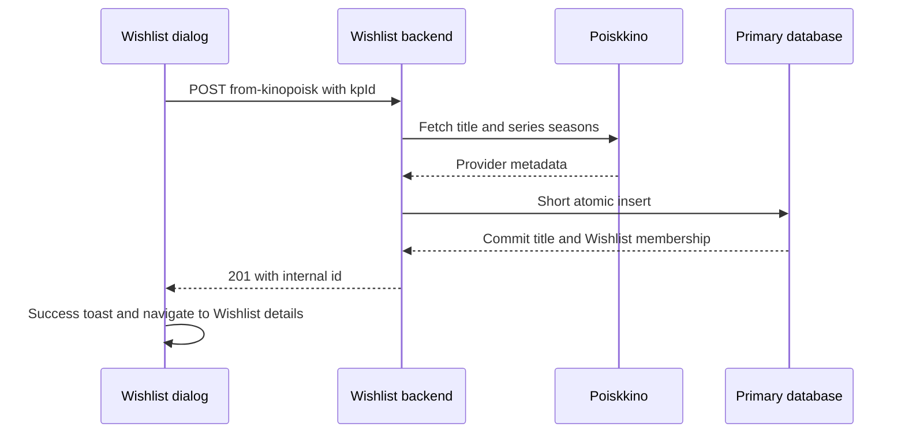

# Wishlist Provider Workflow Plan

Status: implemented in frontend and backend source; live database upgrade is a separate deployment step. This plan replaces the planned Wishlist editor with provider-backed creation and refresh. Existing Movie/Series editors remain the place to complete library-specific fields.

## User flow

1. Wishlist list shows authenticated **Add to wishlist**. A centered native dialog has one labelled Kinopoisk ID input, **Add to wishlist**, and Cancel. Validate positive safe-integer IDs, prevent duplicate submission, focus the input, support Enter/Escape, and restore focus. Use the existing FloatingPanel infrastructure and the project's reactive-form conventions.
2. Submit the ID to the backend. The backend fetches Poiskkino metadata and seasons, validates and maps a Wishlist draft, persists it, then returns its internal ID. On success close the dialog, show a success toast, and navigate to `/gallery/wishlist/:id`. Details loads by that ID through its existing query. Errors retain the entered ID, show a useful error toast, and allow retry.
3. List cards expose View, **Refresh metadata**, and Delete. Wishlist details exposes **Refresh metadata**, **Add to library**, and Delete. Do not introduce a Wishlist Edit route. Reuse existing protected controls and confirmation dialog.
4. Refresh uses the internal ID plus the stored Kinopoisk ID. Show per-item pending state and disable conflicting mutations for that item. On success replace the returned title in the owning store; details updates without navigation. On failure keep the old title and show an error toast.
5. **Add to library** opens `/gallery/movies/new?wishlistId=:id` or `/gallery/series/new?wishlistId=:id` according to kind. The editor loads the Wishlist item by ID and maps it into its normal new-item form. URL identity supports reload and deep links; do not place the complete title in router state or localStorage.
6. Provider fields prefill the editor. Require ordinary library validation and local choices such as movie quality/extension or series-season availability/formats. Opening or cancelling the editor leaves Wishlist unchanged. Successful save moves membership atomically and navigates to the appropriate library details page using the returned ID.
7. Delete requires confirmation on either page. Remove UI state only after success. Details returns to the Wishlist list preserving list context. List reconciles count, pagination and filters, including deleting the last row on a page.



## Proposed API contracts

All mutation endpoints require the existing JWT guard. Public list/details GET contracts remain available. Kinopoisk credentials stay server-only.

| Operation | Endpoint | Request | Success |
| --- | --- | --- | --- |
| Create from provider | `POST /api/wishlist/from-kinopoisk` | `{ kpId: string }` | `201 { id: string }` |
| Refresh metadata | `POST /api/wishlist/:id/refresh` | `{ kpId: string }` | `200 TitleDto` |
| Load details | `GET /api/wishlist/:id` | — | Existing normalized `TitleDto` |
| Delete | `DELETE /api/wishlist/:id` | — | Preserve current backend response; frontend exposes void |
| Save library movie | `POST /api/movies` | Existing movie body plus optional `wishlistId` | Existing movie response with preserved ID |
| Save library series | `POST /api/series` | Existing series body plus optional `wishlistId` | Existing series response with preserved ID |

```typescript
// Source identity is distinct from the provider identity.
type ImportWishlistRequest = { kpId: string };
type RefreshWishlistRequest = { kpId: string };
type CreatedWishlistResponse = { id: string };
// Editor save optionally includes wishlistId; the server still checks canonical kpId.
```

- Canonicalize IDs through the existing provider-ID utilities. UUID/title ID and Kinopoisk ID are different contracts.
- Refresh must match the supplied kpId against the stored canonical kpId. Mismatch is 409; it must not silently retarget the entry to another film.
- Reject unidentified provider kind or provider kind changes with sanitized errors and no mutation. Missing optional metadata stays nullable; do not fabricate ratings, duration, artwork, dates, or formats.
- Create rejects an existing canonical title in Wishlist or Library with 409. Optional structured conflict data identifies existing membership and internal ID so the UI can offer View existing item.
- Keep existing provider error distinctions: not found, unavailable configuration, timeout, sanitized gateway failure. A provider authentication failure must never masquerade as the user's JWT 401.
- Audit consumers before removing generic Wishlist POST/PUT and the old date-only promote operation. The final frontend repository exposes createFromKinopoisk, refresh, find, findById and delete. Replace unused SaveWishlist/PromoteWishlist operations; do not retain parallel unused flows.

## Backend mapping and refresh ownership

Reuse KinopoiskService.getTitleAutofill and its season loading. Add only the Wishlist-specific mapping/orchestration needed to persist that result. Nest services use constructor injection; repository methods own SQL and transactions.

- Create sets membership addedDate from a documented server clock policy, recommended UTC date. It produces no collection formats, and each imported season starts unavailable with no formats. announcedSeasonCount remains unknown unless the provider supplies an authoritative total.
- Refresh replaces provider-owned descriptive fields, ratings, artwork, release date, relationships and production data. Missing optional scalar metadata can become null; a valid empty array clears its provider-owned list. Require a usable display name before committing.
- Preserve internal ID, provider identity, Wishlist addedDate and local formats/availability. Merge seasons by seasonNumber, preserve existing local season fields, add new seasons unavailable, and retain existing seasons omitted by the provider. Keep season release years nullable; do not infer availability from dates.
- Explicit/inferred production status follows the current verified mapper, including open-ended ranges. Keep endYear/status validation consistent. Provider refresh has its own replacement policy; do not blindly reuse the editor autofill merge, which intentionally preserves empty provider fields.

## Transaction and database design

Reuse `titles`, `wishlist_entries`, `library_entries`, subtype tables, seasons and formats. A move changes membership; it does not create a second title or delete/reinsert the parent. Preserve foreign keys and stable title/season identities.

1. Provider network calls happen outside write transactions. Load source identity/revision from the primary, fetch and validate metadata, then start a short write transaction and recheck existence, membership, kpId, kind and revision before applying it.
2. The additive catalog-v8-wishlist-refresh migration creates title_metadata_revisions and an AFTER UPDATE trigger on titles. Missing revision rows mean zero; every title metadata writer advances the revision through the trigger. Refresh compares the captured revision inside the transaction; stale work returns 409 instead of overwriting newer data. No public version contract is required for this internal refresh guard.
3. Use the existing canonical provider lookup/index and primary write-transaction helper. Canonical IDs such as `000123` and `123` must match. Multiple historical matches are an explicit 409; never choose one arbitrarily. Existing historical duplicates prevent blindly adding a global unique provider index; audit before any uniqueness migration and do not delete legacy records to make it pass.
4. Library create checks canonical kpId **inside the same transaction**. With no match, create normally. With exactly one Wishlist-only match of the same kind, reuse its ID, persist validated editor fields and formats/seasons, insert Library membership, then remove Wishlist membership. A Library match is 409 and leaves all records intact.
5. If wishlistId is supplied, verify that exact source exists, is Wishlist-only, and matches the submitted canonical kpId and kind. If it disappeared, changed or was promoted, return a clear not-found/conflict response; do not silently create a replacement. Ordinary new-item saves without wishlistId still check Wishlist by canonical kpId.
6. Rework both legacy Movies create and normalized Series create. Their current conflict checks reject cross-collection matches; the approved Wishlist transition must be handled before those checks. Extract only shared transaction-level identity/membership logic; keep movie/series validation and write policies separate.
7. On any validation, catalog-option, SQL, provider or conflict failure, roll back the whole unit. Retry only the complete rolled-back DB transaction for bounded SQLITE_BUSY retries, rechecking all conditions; never repeat provider calls inside the retry or retry single statements.
8. Deletion removes Wishlist membership and deletes the title only if no membership remains. Cascades clean child records; deleting a Wishlist entry must never remove a Library title. Refresh arriving after delete/promotion fails its membership/revision check and cannot recreate it.
9. Return IDs and refreshed titles from the committed operation. Mutation responses use the primary transaction snapshot; refresh the read replica only after commit. Verify immediate post-create GET observes committed data, and if replica freshness is unavailable use a primary fallback until synchronization succeeds.

SQLite write transactions serialize writers, and foreign-key cascades preserve referential relationships; use the driver helper rather than adding raw transaction statements around it. References: [SQLite isolation](https://www.sqlite.org/isolation.html), [foreign-key support](https://www.sqlite.org/foreignkeys.html).

## Frontend changes

- Extend Wishlist API client, repository and focused application operations for provider creation and refresh; parse unknown responses and normalize AppError consistently.
- Reuse page-scoped Wishlist stores. Track pending mutations per ID, ignore results belonging to a previous route, and cancel stale reads so an old GET cannot overwrite a refresh response. Avoid a second shared entity cache or generic CRUD facade.
- Patch refreshed cards immediately. If refreshed fields affect current sort/filter membership, reconcile using the existing URL-owned list query; preserve filters/page context and correct invalid pages. Details patches its returned title directly.
- Add the focused Kinopoisk-ID dialog through FloatingPanel, using a labelled single-line field, validation feedback, accessible pending state and modal focus handling.
- Seed existing Movie/Series editor stores through their application boundary with GetWishlistTitleQuery and pure converters. Convert normalized nullable data into editable fields without inventing required values; missing fields remain available for user completion. Source item kind must agree with the editor route.
- Remove old Wishlist edit affordances if present; current inspected pages expose View only. Add Refresh/Delete actions to list and Refresh/Add to library/Delete to details.
- Translate actions, validation, confirmations, success/error messages in English, Russian and Polish. Use **Add to library** as the primary transfer label and **Refresh metadata** for provider updates.

## Delivery sequence and acceptance

1. Agree the contracts above; document removal/replacement of superseded callers.
2. Implement provider create/refresh mapping and transactional persistence, including concurrency guard migration and primary-read behavior.
3. Implement atomic Wishlist-to-library saves in both create paths and cover rollback/conflict cases.
4. Connect the add dialog, card/details refresh and confirmed deletion.
5. Add reload-safe editor seeding and source identity on save; remove obsolete unused Wishlist write operations after consumer audit.
6. Update existing Lode contracts to describe the final behavior. Run backend typecheck/lint/build and isolated tests; frontend lint/typecheck/tests/build plus keyboard/focus and AXE checks. Live migrations require explicit authorization.

Required cases: movie and series import; provider seasons; unknown kind; invalid/missing IDs; provider 404/502/504; duplicate/aliased IDs; refresh preserving local fields; concurrent refresh/update/delete/promote; failed library save preserving Wishlist; manual new-item save matching Wishlist; wrong-kind/source-ID mismatch; repeated save returning conflict rather than creating duplicates; stable IDs; no orphan rows; both delete locations; card sort/filter reconciliation; editor reload/cancel; unauthorized mutations; disabled double-submit; success/error toasts and correct navigation.

Related lodes: [Wishlist viewing](wishlist-viewing.md), [Series/Wishlist foundations](../gallery/series-wishlist.md), [Title autofill](../gallery/title-autofill.md), [Floating panels](../ui/floating-panels.md), [Minimal change](../minimal-change.md).
