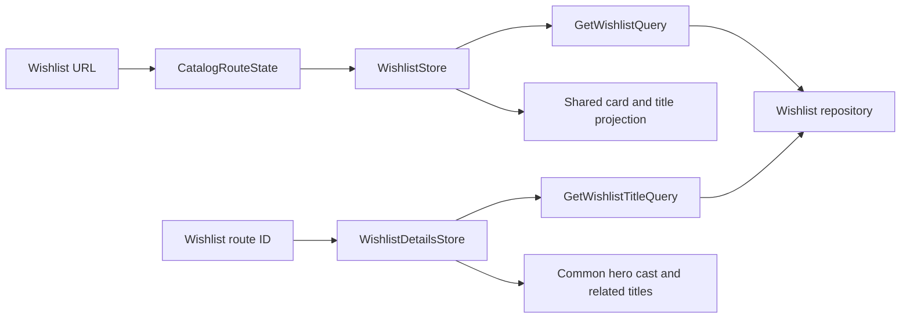

# Wishlist Viewing

Wishlist has public lazy list/details routes at `/gallery/wishlist` and `/gallery/wishlist/:id`. It displays both normalized MovieTitle and SeriesTitle records through existing Wishlist queries and repositories. Signed-in users can add from a Kinopoisk-ID dialog, refresh metadata and delete with confirmation. Details also provide Add to library; see [Wishlist provider workflow](wishlist-provider-workflow.md).

## Ownership and invariants

- `WishlistStore` owns list titles, total count, normalized params and read status. `WishlistDetailsStore` owns the requested ID, nullable title and read status. Both are page-scoped SignalStores; replaceable reads use switchMap, failed requests can retry, and details clear stale content before loading a new ID.
- Page-scoped `catalog/state/catalog-route-state.ts` owns Series/Wishlist URL normalization and navigation. Filter/sort changes reset page zero and preserve search; one-based pager events translate once. Oversized pages are replaced with the last valid page.
- Wishlist pages reuse MediaCard, common detail hero, Production and Cast, related-title lists, filter/sort controls, status/empty states and Pagination. Catalog SCSS owns common collection metadata, production status and detail-summary styles.
- `toTitleCard`/`toTitleDetailsView` accept either kind. MOVIE/SERIES badges reflect title kind; Series also displays production status and year range. Movie duration is shown only when known. Unknown metadata remains unknown; zero ratings/ages remain valid.
- All kinds navigate to Wishlist details, and breadcrumbs/browser history preserve list query parameters. Viewing stays in Wishlist; Add to library selects the Movie or Series new-item route by kind.
- Quality, Additional Information, season tables and season counts are omitted. Business/editor data remains unchanged.
- Runtime Wishlist copy is synchronized in English, Russian and Polish. Headings accept focus, filter dialogs restore focus, and narrow toolbars wrap. Shared year-filter labels and mobile sorting legends use the readable `--color-on-surface-variant` token on tinted surfaces.

```typescript
// WishlistStore reads its own collection for either kind.
const query = inject(GetWishlistQuery);
query.execute(DEFAULT_CATALOG_PARAMS);
// The Wishlist page owns navigation, preserving collection query state.
void router.navigate([title.id], { relativeTo: route, queryParamsHandling: 'preserve' });
```



## Verification and rationale

Focused store tests cover mixed kinds, URL-owned filter/sort/page requests, deduplication, read cancellation and retry. Browser checks cover both kinds, Wishlist-owned routes, preserved queries, responsive layouts and full default AXE rules with mocked API data. Build, lint, all tests and strict TypeScript checks remain quality gates.

The placeholder existed because earlier work prepared shared projections without connecting Wishlist pages. Viewing now calls existing business operations directly; no generic CRUD framework or cross-feature store dependency is needed. Provider import and refresh have dedicated use cases; library-specific fields are completed in the existing Movie/Series editors.

Related lodes: [Shared viewing](series-viewing-simplification.md), [Series viewing](series-viewing.md), [Foundations](../gallery/series-wishlist.md), [Routing](../routing/summary.md), [Minimal change](../minimal-change.md).
