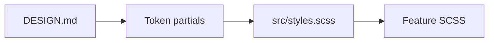

# Practices

MediaShelf follows Angular 22 standalone-component defaults and SCSS global styles. Global design decisions live in native CSS custom properties under `src/styles/tokens/`; component styles should read those values with `var(...)` and avoid introducing parallel SCSS `$variable` APIs for design tokens.

```scss
.toolbar-button {
  min-height: var(--size-control-compact);
  padding: var(--space-sm) var(--space-base);
  font: var(--text-label-lg);
  border-radius: var(--radius-md);
}
```



Invariants:
- `DESIGN.md` is the visual source of truth.
- `src/styles.scss` is the Angular-configured global stylesheet.
- Theme-aware values belong in color/elevation tokens; spacing, typography, sizing, radius, motion, and z-index stay theme-neutral unless the design spec changes.

Related lodes: [summary](summary.md), [UI design tokens](ui/design-tokens.md).
