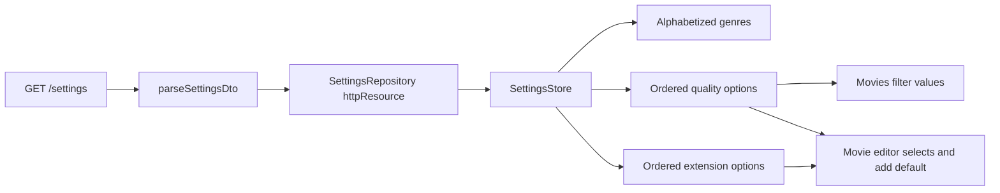

# Settings Resource

`SettingsRepository` owns the app-wide `GET /settings` boundary and one eager cached `httpResource`. It validates the unknown response and derives ordered quality/extension catalogs, defaults, and alphabetized genres. `SettingsStore` is the presentation-facing singleton used by Gallery, so components do not inject raw settings infrastructure. The Settings feature route remains a placeholder.

```typescript
@Service()
export class SettingsStore {
  private readonly repository = inject(SettingsRepository);
  readonly settings = this.repository.settings;
  readonly qualityOptions = this.repository.qualityOptions;
  readonly extensionOptions = this.repository.extensionOptions;
}
```



Invariants:

- The transport contract contains `_id`, `genresForFilters`, `quality`, and `extension`; the parser maps `_id` to frontend `id` and ignores unrelated extra fields.
- `genresForFilters` is an array of strings. Feature consumers receive an alphabetized copy so the DTO remains unchanged.
- A quality option requires non-empty `title` and `value` strings and may contain a boolean `default`; the title is display copy and the value is persisted or sent as a filter.
- An extension option requires a non-empty `value` string and may contain a boolean `default`; its value is both display copy and the persisted value.
- Catalog order is owned by the backend and preserved by the parser and computed signals. Consumers do not sort quality or extension options.
- Missing, malformed, or nested-invalid settings data puts the resource in its error state. Computed catalogs and defaults then expose empty fallbacks without reading `value()` unsafely.
- The first option marked `default` supplies the add-mode value; absence of a marked option yields an empty string and leaves required validation active.
- `MoviesFilterPanel` renders quality titles but stores and submits values. The movie editor uses both catalogs, applies defaults only to blank add fields when settings first become available, and never replaces edit values.
- A saved edit value absent from the current catalog is appended locally to that editor select only; the cached settings DTO is never mutated.

Related lodes: [project summary](../summary.md), [terminology](../terminology.md), [media gallery](../ui/media-gallery.md), [movie editor](../plans/movie-editor.md), [practices](../practices.md).
