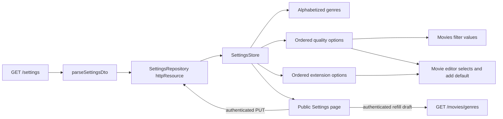

# Settings Resource

`SettingsRepository` owns the app-wide settings boundary and one eager cached `httpResource`. It validates `GET /settings`, derives ordered quality/extension catalogs, defaults, and alphabetized genres, persists the complete settings document with `PUT /settings`, and reads refill candidates from `GET /movies/genres`. `SettingsStore` is the presentation-facing singleton used by Gallery and the Settings page, so components do not inject raw settings infrastructure.

```typescript
@Service()
export class SettingsStore {
  private readonly repository = inject(SettingsRepository);
  readonly settings = this.repository.settings;
  readonly qualityOptions = this.repository.qualityOptions;
  readonly extensionOptions = this.repository.extensionOptions;

  refillGenres() {
    return this.repository.refillGenres();
  }

  update(settings: SettingsDto) {
    return this.repository.update(settings);
  }
}
```



Invariants:

- The transport contract contains `_id`, `genresForFilters`, `quality`, and `extension`; the parser maps `_id` to frontend `id` and ignores unrelated extra fields.
- `genresForFilters` is an array of strings. Feature consumers receive an alphabetized copy so the DTO remains unchanged.
- A quality option requires non-empty `title` and `value` strings and may contain a boolean `default`; the title is display copy and the value is persisted or sent as a filter.
- An extension option requires a non-empty `value` string and may contain a boolean `default`; its value is both display copy and the persisted value.
- Quality and extension options may expose a nonempty `id`; parsing retains it for Series/Wishlist format pairs. Legacy value-only options remain supported. Format writes use IDs while Movies fields and filters continue to use values.
- Catalog order is owned by the backend and preserved by the parser and computed signals. Consumers do not sort quality or extension options.
- Missing, malformed, or nested-invalid settings data puts the resource in its error state. Computed catalogs and defaults then expose empty fallbacks without reading `value()` unsafely.
- The first option marked `default` supplies the add-mode value; absence of a marked option yields an empty string and leaves required validation active.
- `/settings` remains public. Guests see the loaded defaults and genres, but all form controls, genre actions, Discard, and Save are natively disabled. Authentication is required for every mutation.
- The page is one editor rather than separate read/edit screens. It uses a Signal Form for default quality, default extension, and the add-genre field; its genre draft is signal state kept separate from the form's scalar fields. `settings.model.ts` owns page/form types and the empty form value, while `settings.utils.ts` owns pure DTO projection, sorting, and equality helpers; `settings.ts` contains only component orchestration.
- Discard restores the last settings value held by the cached resource. Save preserves the backend-owned quality and extension catalogs, rewrites their `default` flags, maps frontend `id` back to transport `_id`, sends the complete document to `PUT /settings`, and replaces the cached resource with the validated response.
- Genre names can be added or removed one at a time. Add trims the name, rejects case-insensitive duplicates, and keeps the draft alphabetized.
- Refill validates either a string array or `{ genres: string[] }` from `GET /movies/genres`, trims, de-duplicates, and alphabetizes the result. Refill replaces only the local draft; the user must press Save to persist it.
- The page has loading/error/retry states and localized success/error toasts for initial or retried settings loads, refill, and save. A resource-state effect only reports completed load outcomes; cache replacement after Save retains the dedicated save feedback. Its action bar intentionally omits breadcrumbs.
- `MoviesFilterPanel` renders quality titles but stores and submits values. The movie editor uses both catalogs, applies defaults only to blank add fields when settings first become available, and never replaces edit values.
- A saved edit value absent from the current catalog is appended locally to that editor select only; the cached settings DTO is never mutated.

Related lodes: [Series/Wishlist formats](../gallery/series-wishlist.md), [project summary](../summary.md), [terminology](../terminology.md), [media gallery](../ui/media-gallery.md), [movie editor](../plans/movie-editor.md), [practices](../practices.md).
