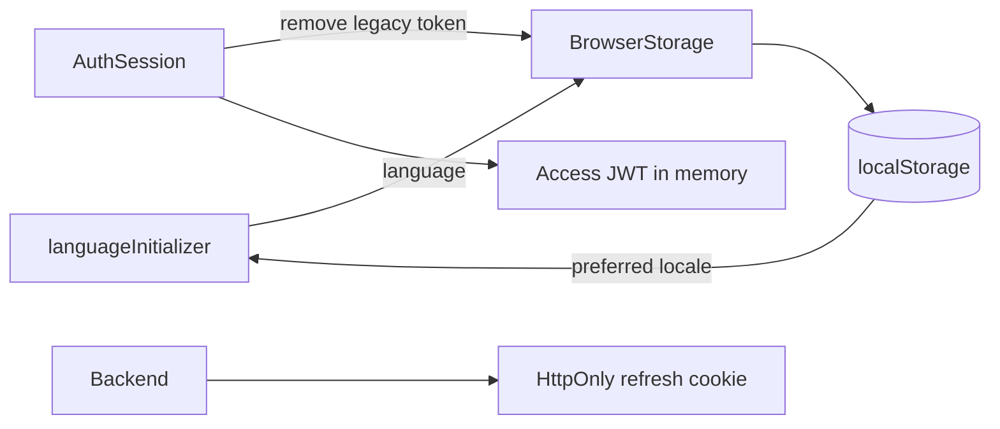

# Browser Storage

`BrowserStorage` is the guarded wrapper around same-origin `localStorage`. Callers use `StorageKey` instead of string literals. Storage access is best-effort; restricted contexts continue with in-memory state.

```typescript
storage.set(StorageKey.Language, 'en');
// AuthSession removes the legacy token key; no new tokens are persisted here.
storage.remove(StorageKey.Token);
```



Contracts:

- `language` stores a supported locale. `token` exists only for migration cleanup.
- Feature code calls `BrowserStorage.get`, `set`, or `remove` rather than accessing localStorage directly.
- The wrapper resolves storage through `DOCUMENT.defaultView` and catches unavailable-storage errors.
- Authentication restores through the backend refresh cookie. Access JWTs remain in memory; neither access nor refresh tokens are written to localStorage.
- Internationalization prefers a supported stored language, otherwise selects a supported browser language or English, then persists the result.

Related lodes: [authentication](../auth/summary.md), [internationalization](../i18n/summary.md), [practices](../practices.md).
