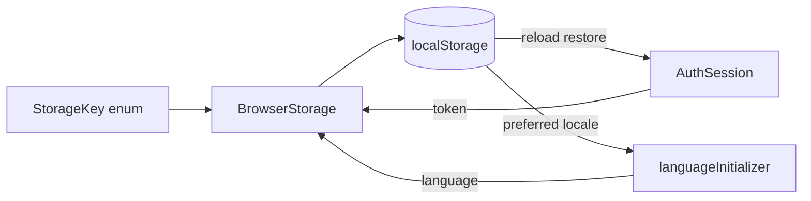

# Browser Storage

`BrowserStorage` is the single guarded wrapper around same-origin `localStorage`. Callers use `StorageKey` instead of string literals so persisted contracts remain discoverable and consistent. Storage access is best-effort: privacy or restricted contexts may reject access, in which case application state continues in memory for the current page.

```typescript
export enum StorageKey {
  Language = 'language',
  Token = 'token',
}

storage.set(StorageKey.Token, accessToken);
```



Contracts:

- The only current keys are exact values `token` and `language`.
- Feature code never accesses `localStorage` directly; it calls `BrowserStorage.get`, `set`, or `remove` with `StorageKey`.
- `BrowserStorage` resolves storage through `DOCUMENT.defaultView` and catches unavailable-storage errors, preserving compatibility with tests and non-browser rendering contexts.
- The persisted JWT is sensitive to same-origin script execution. Backend validation remains authoritative, and an HttpOnly-cookie session is preferred if the backend later supports it.
- Authentication removes the token on explicit sign-out, JWT expiry, invalid restoration, or an authenticated `401`.
- Internationalization prefers a supported stored language, otherwise selects a supported browser language or English, then persists the result.

Related lodes: [authentication](../auth/summary.md), [internationalization](../i18n/summary.md), [practices](../practices.md).
