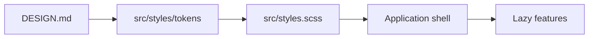

# MediaShelf Summary

MediaShelf is a private, local, non-commercial Angular 22 SCSS pet project for managing a personal collection of movies and TV series. It is a personal media library where the user can browse, search, filter, sort, add, edit, delete, and inspect movies and series, maintain a wishlist, and track metadata, technical flags, ratings, and collection states. The responsive app shell composes a route-driven header, a full-width main `RouterOutlet`, and a package-versioned footer around lazy gallery, statistics, and settings boundaries; wishlist is owned by gallery at `/gallery/wishlist`. The visual foundation is global native CSS custom properties imported from `src/styles.scss`; app code should consume semantic tokens instead of hard-coded color, spacing, typography, radius, border, shadow, motion, size, or z-index values.

```scss
.media-panel {
  background: var(--color-surface);
  border: var(--border-subtle);
  border-radius: var(--radius-lg);
  box-shadow: var(--shadow-level-1);
}
```



Related lodes: [practices](practices.md), [terminology](terminology.md), [application shell](ui/application-shell.md), [UI tokens](ui/design-tokens.md), [routing](routing/summary.md).
