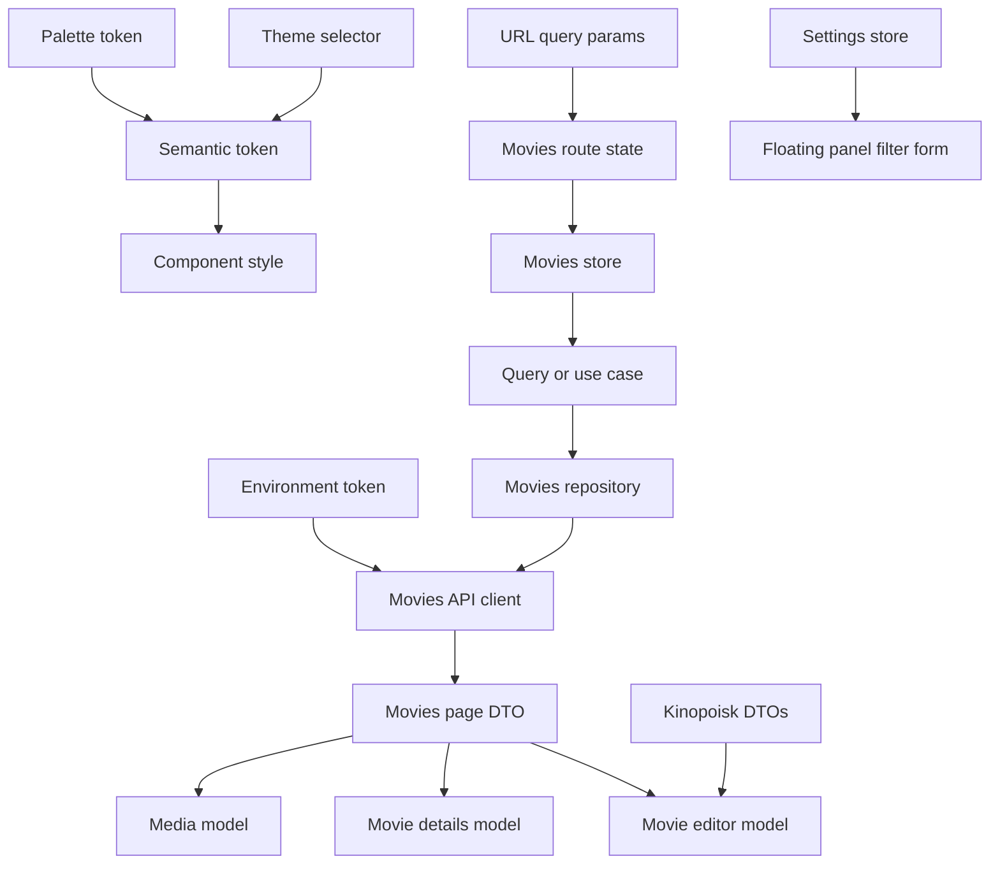

# Terminology

- Design token - Native CSS custom property exposed from `src/styles/tokens/` for reusable visual decisions.
- Semantic token - A role-based token such as `--color-surface` or `--color-text-primary`; application code should prefer these over palette tokens.
- Palette token - A raw color token such as `--palette-slate-200`; these support semantic tokens and are not the preferred component API.
- Theme selector - `[data-theme='light']` or `[data-theme='dark']`, used to switch theme-aware color variables.
- Media badge - A compact label for taxonomy or metadata states including Movie, Series, Wishlist, Rating, Quality, and Age Rating.
- Wishlist - A gallery-owned child collection at `/gallery/wishlist` for movies or series the user wants to track separately from fully cataloged entries.
- Application shell - The shared header, main router outlet, and footer composed by the root `App` component.
- Root navigation item - A header link derived from `navigation` metadata on a navigable root route.
- Brand mark - The canonical MediaShelf logo exported from Figma node `15:2` and stored at `public/logo.svg`.
- Environment - Build-selected frontend runtime configuration used to provide the production flag and API base URL.
- Environment token - The `ENVIRONMENT` injection token that exposes the selected environment through Angular DI.
- Movies repository - The application-facing data contract implemented by `HttpMoviesRepository`; it hides endpoints, DTO parsing, mapping, and HTTP errors from stores and use cases.
- Movies API client - The thin infrastructure client that constructs `/movies` HTTP requests and returns raw transport responses for repository validation.
- Application query - A read-oriented operation such as `GetMoviesQuery` or `GetMovieDetailsQuery` that exposes repository data to feature state.
- Application use case - A state-changing or reusable workflow such as delete, save, or autofill, independent of UI feedback and navigation.
- Application error - A stable `AppError` kind produced at infrastructure boundaries instead of leaking `HttpErrorResponse` into state.
- Media DTO - The transport shape loaded from the gallery API; it is converted before presentation code consumes it.
- Media model - The immutable card-ready projection produced by `toMedia`, including formatted year, duration, and poster fallback.
- Movies params - The URL-backed movie request contract containing a zero-based API page index, required sorting values, page size, and optional filters.
- Quick search - The Gallery-owned header search that debounces preview requests to `/movies?search=...`, links preview rows to details, and applies successful non-empty searches to the URL-backed Movies list on Enter.
- Movies filters - The optional URL-backed `MoviesParams` subset for genres, years, minimum rating, age ratings, qualities, actors, and directors.
- Movies sorting - The required URL-backed `{ key, direction }` pair that selects server-side media ordering and resets pagination when changed.
- Settings store - The presentation-facing singleton that exposes the cached `/settings` resource, catalogs, and defaults supplied by `SettingsRepository`.
- Settings option - A backend-owned selectable value; quality options pair a display `title` with a persisted `value`, extension options expose their persisted `value`, and either kind may mark one add-mode `default`.
- Floating panel - A dynamically attached native-dialog container opened through `FloatingPanel`, with injected data, typed close results, responsive placement, cleanup, and focus restoration.
- Anchored responsive panel - A floating-panel placement aligned below a desktop trigger that becomes a modal bottom sheet on mobile.
- Active filter group - One applied filter category counted in the Filters badge; the from/to year pair counts as one group.
- Movies page - The converted API result containing the current server page, its media records, and the collection-wide total count.
- Archival pagination bar - The shared one-based pager that displays current page, total pages, total item count, and bounded page controls.
- Poster placeholder - The local branded `public/poster-placeholder.svg` used when poster URLs are absent or fail to load.
- Toast viewport - The single root-owned, fixed bottom-right region that renders notifications from `ToastStore` with the newest toast at the bottom.
- Translation key - A contextual identifier such as `movies.empty`; components render keys through ngx-translate instead of owning interface copy.
- Movies route state - The list-specific adapter that normalizes `ActivatedRoute` query parameters and performs URL updates without becoming a second state source.
- Movies store - The feature-scoped NgRx SignalStore that owns movie page state and delegates reads/deletion to application operations.
- Movie details - The immutable detail projection loaded from `GET /movies/{id}` and presented at `/gallery/movies/:id` without widening the card-oriented Media model.
- Kinopoisk rating link - The detail hero rating anchor derived from `MediaDto.kpId`, opening `https://www.kinopoisk.ru/film/{kpId}` in a new tab.
- Movie editor - The shared add/edit Signal Form at `/gallery/movies/new` and `/gallery/movies/:id/edit`; its store consumes `MovieEditorModel` while DTO conversion remains in infrastructure.
- Kinopoisk autofill - Movie-editor metadata loaded by Kinopoisk ID from PoiskKino's `GET /v1.4/movie/{id}` endpoint with `X-API-KEY` authentication.
- Confirmation dialog - Shared `FloatingPanel` content that returns an explicit boolean decision while native dialog modality, dismissal, cleanup, and focus restoration remain infrastructure concerns.
- Auth session - The expiring JWT state persisted under `StorageKey.Token`; it survives reloads and is cleared by Sign Out, JWT expiry, invalid restoration, or authenticated 401 responses.
- Storage key - A centralized `StorageKey` enum member used by `BrowserStorage`; current exact keys are `token` and `language`.
- Form validation message - The shared Signal Form component that renders the first validator-provided translated error after a field becomes touched and invalid, or maps standard error kinds to specific shared translations when custom copy is absent.
- Protected control - A write-action control whose native disabled state is centrally combined with `AuthSession` through `mshRequiresAuth`.

```scss
.movie-badge {
  color: var(--color-badge-movie-text);
  background: var(--color-badge-movie-bg);
  border: 1px solid var(--color-badge-movie-border);
}
```



Related lodes: [summary](summary.md), [settings resource](settings/summary.md), [media gallery](ui/media-gallery.md), [UI design tokens](ui/design-tokens.md), [toast notifications](ui/toast-notifications.md).
