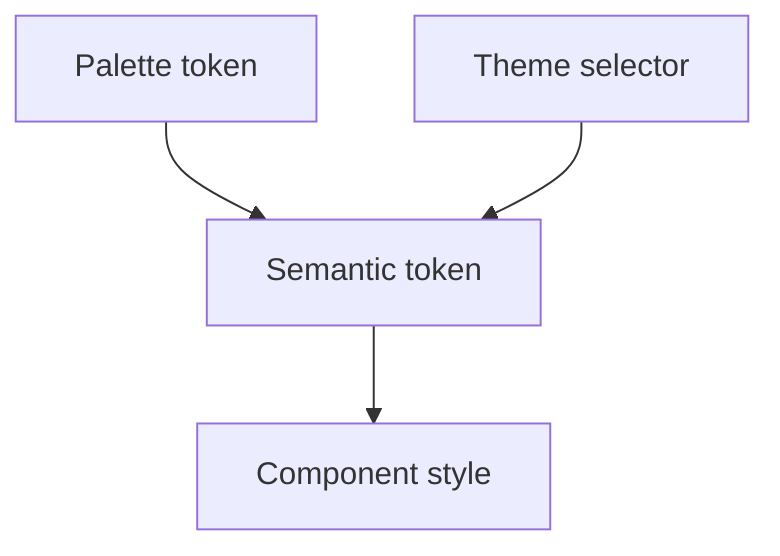

# Terminology

- Design token - Native CSS custom property exposed from `src/styles/tokens/` for reusable visual decisions.
- Semantic token - A role-based token such as `--color-surface` or `--color-text-primary`; application code should prefer these over palette tokens.
- Palette token - A raw color token such as `--palette-slate-200`; these support semantic tokens and are not the preferred component API.
- Theme selector - `[data-theme='light']` or `[data-theme='dark']`, used to switch theme-aware color variables.
- Media badge - A compact label for taxonomy or metadata states including Movie, Series, Wishlist, Rating, Quality, and Age Rating.
- Wishlist - A personal list of movies or series the user wants to track separately from fully cataloged collection entries.

```scss
.movie-badge {
  color: var(--color-badge-movie-text);
  background: var(--color-badge-movie-bg);
  border: 1px solid var(--color-badge-movie-border);
}
```



Related lodes: [summary](summary.md), [UI design tokens](ui/design-tokens.md).
