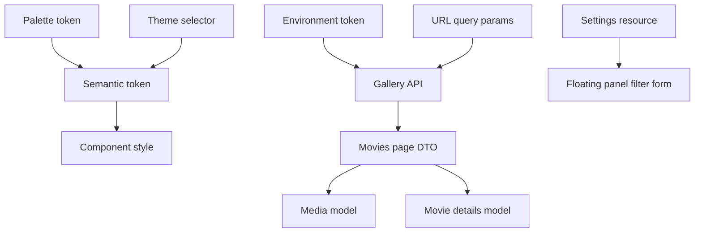

# Terminology

- Design token - Native CSS custom property exposed from `src/styles/tokens/` for reusable visual decisions.
- Semantic token - A role-based token such as `--color-surface` or `--color-text-primary`; application code should prefer these over palette tokens.
- Palette token - A raw color token such as `--palette-slate-200`; these support semantic tokens and are not the preferred component API.
- Theme selector - `[data-theme='light']` or `[data-theme='dark']`, used to switch theme-aware color variables.
- Media badge - A compact label for taxonomy or metadata states including Movie, Series, Wishlist, Rating, Quality, and Age Rating.
- Wishlist - A gallery-owned child collection at `/gallery/wishlist` for movies or series the user wants to track separately from fully cataloged entries.
- Application shell - The shared header, main router outlet, and footer composed by the root `App` component.
- Root navigation item - A header link derived from `navigation` metadata on a navigable root route.
- Brand mark - The canonical MediaShelf logo exported from Figma node `15:2` and stored at `public/logo.svg`.
- Environment - Build-selected frontend runtime configuration used to provide the production flag and API base URL.
- Environment token - The `ENVIRONMENT` injection token that exposes the selected environment through Angular DI.
- Gallery API - The feature data-access service that requests gallery endpoints from `environment.apiUrl` and converts transport data to UI media models.
- Gallery endpoint - A typed API path segment for gallery collections: `movies`, `series`, or `wishlist`; Movies currently uses `movies`.
- Media DTO - The transport shape loaded from the gallery API; it is converted before presentation code consumes it.
- Media model - The immutable card-ready projection produced by `toMedia`, including formatted year, duration, and poster fallback.
- Movies params - The URL-backed movie request contract containing a zero-based API page index, required sorting values, page size, and optional filters.
- Movies filters - The optional URL-backed `MoviesParams` subset for genres, years, minimum rating, age ratings, qualities, actors, and directors.
- Movies sorting - The required URL-backed `{ key, direction }` pair that selects server-side media ordering and resets pagination when changed.
- Settings resource - The cached app-wide `/settings` HTTP resource whose `genresForFilters` values populate filter choices and whose DTO remains reusable by the Settings feature.
- Floating panel - A dynamically attached native-dialog container opened through `FloatingPanel`, with injected data, typed close results, responsive placement, cleanup, and focus restoration.
- Anchored responsive panel - A floating-panel placement aligned below a desktop trigger that becomes a modal bottom sheet on mobile.
- Active filter group - One applied filter category counted in the Filters badge; the from/to year pair counts as one group.
- Movies page - The converted API result containing the current server page, its media records, and the collection-wide total count.
- Archival pagination bar - The shared one-based pager that displays current page, total pages, total item count, and bounded page controls.
- Poster placeholder - The local branded `public/poster-placeholder.svg` used when poster URLs are absent or fail to load.
- Toast viewport - The single root-owned, fixed bottom-right region that renders notifications from `ToastStore` with the newest toast at the bottom.
- Translation key - A contextual identifier such as `movies.empty`; components render keys through ngx-translate instead of owning interface copy.
- Movies store - The feature-scoped NgRx SignalStore that owns movie loading, request state, current page, and visible-page derivation.
- Movie details - The immutable detail projection loaded from `GET /movies/{id}` and presented at `/gallery/movies/:id` without widening the card-oriented Media model.
- Kinopoisk rating link - The detail hero rating anchor derived from `MediaDto.kpId`, opening `https://www.kinopoisk.ru/film/{kpId}` in a new tab.

```scss
.movie-badge {
  color: var(--color-badge-movie-text);
  background: var(--color-badge-movie-bg);
  border: 1px solid var(--color-badge-movie-border);
}
```



Related lodes: [summary](summary.md), [media gallery](ui/media-gallery.md), [UI design tokens](ui/design-tokens.md), [toast notifications](ui/toast-notifications.md).
