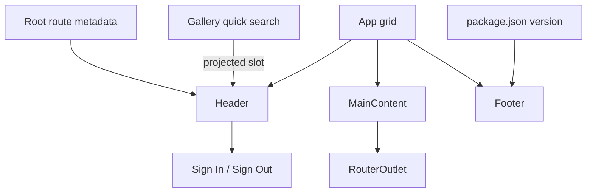

# Application Shell

The root `App` composes three standalone, OnPush layout components: `Header`, `MainContent`, and `Footer`. The host is a row grid with `auto minmax(0, 1fr) auto`, so short feature pages keep the footer at the viewport bottom while long pages expand normally. `MainContent` owns the application's only semantic `<main>` and primary `RouterOutlet`; routed feature pages use sections and own their internal grids and padding.

```html
<msh-header [navigationItems]="navigationItems">
  <msh-quick-search header-search />
</msh-header>
<msh-main-content />
<msh-footer [version]="version" />
```

```scss
.main-content {
  display: grid;
  align-content: start;
  min-height: 100%;
}
```



Contracts:

- The desktop header is 56 px high with 24 px inline padding; at 48 rem and below it is 64 px high with 16 px padding.
- The application header is sticky at the viewport top and remains above feature-level sticky navigation.
- Mobile navigation remains in the header and scrolls horizontally. The right-side authentication action becomes icon-only visually while retaining its translated accessible text.
- The header renders Sign In for an empty session and Sign Out for an authenticated session restored from storage when valid. Sign In opens the authorization dialog; Sign Out clears both signal and persisted token state and reports success through the global toast viewport.
- The header receives root navigation items from `App`; it does not import route configuration.
- The header exposes a `[header-search]` projection slot. `App` fills it with the Gallery-owned debounced quick search, preserving the rule that layout never imports feature logic.
- Header search is hidden at 640 px and below so the existing mobile navigation and authentication action retain their compact shell contract.
- `Gallery` remains active for `/gallery` child URLs such as `/gallery/wishlist`.
- The main content shell is full width and adds no feature padding.
- Routed components are aligned to the top of the main content shell; empty and short feature pages leave unused space below their content.
- The footer displays the product description, `Library Synced`, and the `package.json` version through `APP_VERSION`.
- Nunito Sans weights 400, 600, 700, and 800 are bundled locally through `@fontsource/nunito-sans`.
- Shell components use `--color-shell-*` and `--size-shell-*` tokens rather than hard-coded layout values.

Related lodes: [authentication](../auth/summary.md), [UI summary](summary.md), [design tokens](design-tokens.md), [quick search](quick-search.md), [routing](../routing/summary.md).
