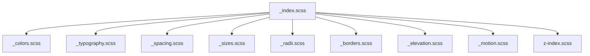

# Global Design Tokens

Global design tokens are native CSS custom properties split into focused SCSS partials under `src/styles/tokens/` and imported through `src/styles.scss`. `DESIGN.md` remains the visual source of truth; the token set mirrors its color palette, typography hierarchy, spacing, layout sizes, radii, elevations, borders, motion timings, and z-index layers.

```scss
@use 'styles/tokens';

.poster-card {
  aspect-ratio: var(--size-poster-aspect-ratio);
  background: var(--color-surface-inset);
  border: var(--border-subtle);
  border-radius: var(--radius-lg);
  transition:
    transform var(--duration-fast) var(--easing-standard),
    box-shadow var(--duration-fast) var(--easing-standard);
}
```



Contracts:
- Components consume semantic tokens such as `--color-surface`, `--color-primary`, `--text-body-md`, `--space-base`, `--radius-md`, and `--shadow-level-1`.
- Palette tokens may exist to compose color semantics, but component code should not depend on raw palette names unless it is defining a new semantic token.
- Light colors are defined on `:root, [data-theme='light']`; dark colors are defined on `[data-theme='dark']`.
- Non-color tokens are theme-neutral.
- Angular Material theming is not configured in the project; there is no Material token bridge yet.

Related lodes: [UI summary](summary.md), [practices](../practices.md), [terminology](../terminology.md).
