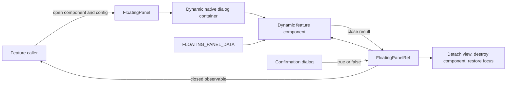

# Floating Panels

`FloatingPanel` is the business-agnostic API for modal floating UI. It dynamically creates a native `<dialog>` container under `document.body`, attaches an arbitrary Angular component through `ViewContainerRef`, and provides typed data and a `FloatingPanelRef<TResult>` through dependency injection. Only one panel is active at a time.

```typescript
const ref = floatingPanel.open<FilterPanel, FilterData, FilterResult>(FilterPanel, {
  ariaLabelledBy: 'filter-panel-title',
  data: { filters },
  owner: destroyRef,
  placement: 'responsive',
});

ref.closed.subscribe((result) => {
  if (result) apply(result);
});
```



Contracts:

- `FloatingPanelConfig` controls data, accessible naming, backdrop/Escape dismissal, placement, panel classes, and focus restoration.
- Route/component callers pass their `DestroyRef` as `owner`; owner destruction closes the panel, destroys its dynamically attached view, removes global listeners, and prevents orphan dialogs after navigation.
- Dialog descriptions use `ariaDescribedBy` on the native `<dialog>` when content such as a destructive confirmation message must be announced with its label.
- Callers may opt into `closeOnScroll`; captured scroll events outside the panel close it, while internal panel scrolling is ignored. Listener cleanup is part of the same close lifecycle as view and host teardown.
- Content injects `FLOATING_PANEL_DATA` and `FloatingPanelRef`; callers receive the same reference with the dynamically created component instance and a completing `closed` observable.
- Opening a second panel closes and destroys the active panel before attaching the next one.
- Native dialog modality provides top-layer rendering and prevents interaction with background content.
- Backdrop and Escape dismissal return `undefined`; an explicit result is supplied by content calling `close(result)`.
- Closing detaches the Angular view, destroys the container and its content, removes the host element, completes the result stream, and restores the previously focused element when it still exists.
- `responsive` placement is a full-height end sheet on desktop and a full-height sheet on mobile; neither mode uses a top offset.
- `anchored-responsive` accepts an `HTMLElement` anchor. It opens beneath and end-aligned with the trigger, updates its anchor coordinates on resize, and becomes a content-height modal bottom sheet with a scrim on mobile. Feature-specific `panelClass` values may narrow the shared maximum width and radius; Movies sorting uses an 18rem-wide, 8px-radius desktop panel.
- Enter motion uses design motion tokens and is removed for reduced-motion preferences.
- Shared destructive confirmations use `ConfirmationDialog` with translated title/message/action keys and a boolean result. Cancel receives initial focus; confirmation is danger-styled, while Escape and backdrop dismissal return no affirmative result.

Rationale and lessons:

- Dynamic attachment belongs in one shared service so feature components remain ordinary injectable Angular components.
- The native dialog supplies semantics and modality without adding Angular CDK or duplicating its full overlay system.
- Panel content owns its header, body, footer, and result contract; the shared container owns only lifecycle and placement.

Related lodes: [UI summary](summary.md), [media gallery](media-gallery.md), [application shell](application-shell.md), [practices](../practices.md).
