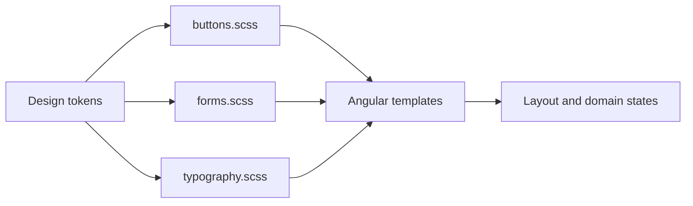

# Global Style Primitives

Reusable visual components live under `src/styles/components/` and are loaded once by `src/styles.scss`. They provide a Bootstrap-like composition API backed entirely by MediaShelf semantic tokens. Feature SCSS owns layout and domain-specific state only; it must not restate complete button, typography, or form-control recipes.

```html
<button class="btn btn-primary">Apply</button>
<button class="btn btn-secondary">Reset</button>
<button class="btn btn-icon btn-ghost" aria-label="Close">×</button>
<div class="btn-group btn-group-uniform">
  <button class="btn btn-primary">Filter</button>
  <button class="btn btn-compact btn-secondary">Sort</button>
</div>

<label class="form-label">
  Director
  <input class="form-control" />
</label>

<h2 class="text-headline-sm">Sort Media</h2>
```



## Button contract

- Every shared button starts with `.btn`.
- Visual variants are `.btn-primary`, `.btn-secondary`, `.btn-surface`, `.btn-ghost`, `.btn-danger`, and the poster-scrim pair `.btn-overlay`/`.btn-overlay-danger`.
- Size and shape modifiers are `.btn-compact`, `.btn-sm`, `.btn-xs`, `.btn-icon`, `.btn-block`, and `.btn-mobile-standard`.
- `.btn-group` supplies shared inline action layout. Adding `.btn-group-uniform` normalizes every nested `.btn` to the standard control height, padding, and label role, including buttons rendered by projected child components.
- `.btn` centrally owns alignment, spacing, typography, border geometry, transitions, focus visibility, and disabled state. Variants own semantic colors and hover/active behavior.
- Feature selectors may adjust placement, flex growth, or a design-specific radius, but must not recreate the entire button recipe.

## Typography contract

- `.text-display-lg`, `.text-headline-*`, `.text-title-md`, `.text-body-*`, `.text-label-*`, and `.text-code-sm` expose the Stitch type roles as reusable classes.
- Typography utilities set font shorthand and the role's required letter spacing only. Margins, color, alignment, truncation, and responsive role changes remain contextual.

## Form contract

- `.form-fieldset` resets fieldset browser chrome; `.form-legend` applies the standard legend role; `.form-legend-sr-only` visually hides an accessible legend.
- `.form-label` provides label typography and spacing.
- `.form-control` owns text-control surface, padding, placeholder, focus, and disabled behavior; `.form-control-compact` changes only control height.
- `.form-range` owns the primary accent for ranges, and `.form-radio-input` supplies the reusable visually-hidden native radio input contract.
- `.segmented-control` owns the shared two-column inset frame. Its actions are ordinary `.btn` compositions.

The Movies toolbar, filter panel, sorting trigger/panel, page header, and empty state are current reference consumers.

Related lodes: [design tokens](design-tokens.md), [floating panels](floating-panels.md), [media sorting](../plans/media-sorting.md), [practices](../practices.md).
