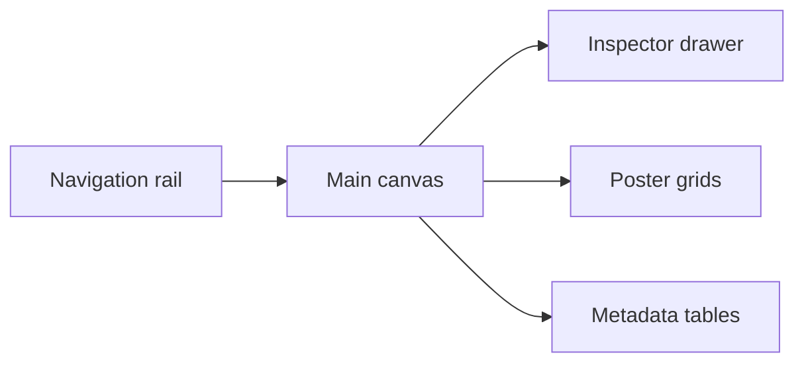

# UI Summary

The MediaShelf UI is specified as a restrained desktop workspace with a fixed navigation rail, fluid media canvas, optional inspector drawer, dense poster grids, tabular metadata views, and semantic badges for collection and technical states. Current UI implementation work should start from the global token layer rather than one-off component values.

```scss
.media-shell {
  display: grid;
  grid-template-columns: var(--size-sidebar-width) minmax(0, 1fr) var(--size-inspector-width);
  gap: var(--size-grid-gutter);
  background: var(--color-background);
}
```



Related lodes: [project summary](../summary.md), [design tokens](design-tokens.md).
