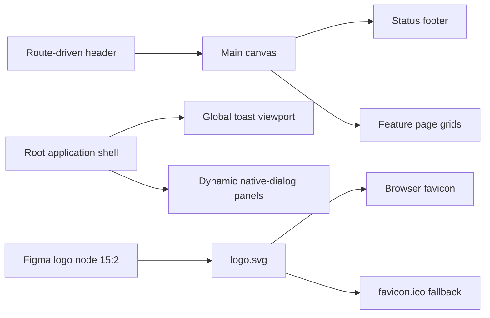

# UI Summary

The MediaShelf UI uses a restrained, full-width application shell with header navigation, a fluid feature canvas, a compact status footer, a global bottom-right toast viewport, and dynamically attached native-dialog floating panels. Gallery adds route-derived local navigation and a responsive Movies canvas built from reusable media cards, badges, ratings, filters, and archival pagination. Current UI work starts from the global token layer rather than one-off component values. The canonical brand mark is the Figma-exported `public/logo.svg`; browsers use it as the primary favicon and `public/favicon.ico` as the multi-size compatibility fallback.

```scss
:host {
  display: grid;
  grid-template-rows: auto minmax(0, 1fr) auto;
  min-height: 100dvh;
  background: var(--color-shell-background);
}
```

```html
<link rel="icon" type="image/x-icon" href="favicon.ico" sizes="16x16 32x32 48x48" />
<link rel="icon" type="image/svg+xml" href="logo.svg" sizes="any" />
```



Invariants:

- `public/logo.svg` is the unmodified vector export of Figma node `15:2`.
- `public/favicon.ico` contains 16 px, 32 px, and 48 px rasterizations of the canonical SVG.
- Application code references local public assets and never temporary Figma asset URLs.
- The shared shell owns the only `<main>` landmark; feature roots use sections.
- The root shell owns the only toast viewport; callers communicate through `ToastStore`.
- Feature callers open modal sheets through `FloatingPanel`; dynamic panel content remains feature-owned.

Related lodes: [project summary](../summary.md), [application shell](application-shell.md), [design tokens](design-tokens.md), [floating panels](floating-panels.md), [media gallery](media-gallery.md), [toast notifications](toast-notifications.md).
