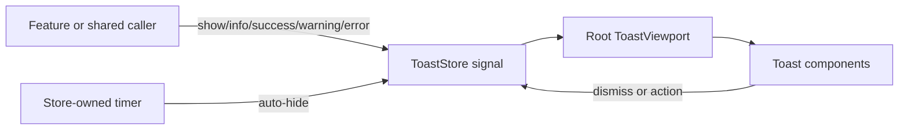

# Toast Notifications

Toast notifications are app-wide transient messages rendered by one `ToastViewport` in the root application shell. Callers inject `ToastStore`; they do not create viewport or toast components directly. The store owns ordered signal state and every auto-hide timer, while the `Toast` component owns visual semantics and user controls.

```typescript
import { ToastStore } from '@msh-shared/services/toast-store';
import { inject } from '@angular/core';

const toastStore = inject(ToastStore);

toastStore.success({
  title: 'Media saved',
  message: 'The library entry is ready.',
  autoHide: true,
  delay: 1_500,
});
```



Contracts:

- Supported types are `info`, `success`, `warning`, and `error`; each maps to dedicated light and dark semantic color tokens.
- `show()` accepts a required `title` plus optional `message`, `type`, `closable`, `autoHide`, `delay`, and `action`.
- `info()`, `success()`, `warning()`, and `error()` are typed convenience methods over `show()`.
- Toasts are closable by default and do not auto-hide by default. These settings are independent, so either, both, or neither behavior may be enabled.
- Auto-hide uses `5,000` ms when delay is absent, non-finite, zero, or negative. A positive finite delay is used unchanged.
- App-wide auto-hide timings live in `TOAST_AUTO_HIDE_DELAY_MS`: success feedback uses `2,500` ms, error feedback and the default fallback use `5,000` ms. Features and `ToastStore` consume this shared contract instead of defining local duration constants.
- `show()` returns a numeric `ToastId`; `dismiss(id)` is idempotent and `clear()` removes all notifications.
- Activating an optional action invokes its handler and dismisses the toast, including when the handler throws.
- `ToastStore` cancels associated timers on manual dismissal, clear, and service destruction.
- Toast order is oldest to newest in DOM order, which places the newest notification at the bottom of the fixed bottom-right stack.
- Info and success use `role="status"`; warning and error use `role="alert"`. Toast contents are atomic announcements.
- Enter and leave behavior uses Angular's native `animate.enter` and `animate.leave` CSS API and honors reduced-motion preferences.
- The viewport uses the toast z-index token, safe-area insets, a 28 rem maximum width, and a responsive viewport-relative width.
- URL-driven Movies loads use localized success and error toasts; these auto-hide after 2.5 and 5 seconds respectively. Loading and error state also remain visible in-page, and unchanged query parameters do not trigger background requests.
- Route-driven movie-detail loads use the same 2.5-second success and 5-second error durations. Detail failures retain an in-page error with Retry and Back to movies actions.

Rationale and lessons:

- Timer ownership stays beside state ownership so every removal path can cancel pending work.
- The global viewport avoids feature-level stacking conflicts and preserves notifications during route changes.
- Auto-hide is opt-in; its 5-second fallback keeps status feedback readable without forcing a duration on persistent notifications.
- The implementation adapts Figma node `32:560` geometry and elevation while using MediaShelf semantic tokens instead of raw component colors.

Related lodes: [UI summary](summary.md), [design tokens](design-tokens.md), [application shell](application-shell.md), [project practices](../practices.md).
