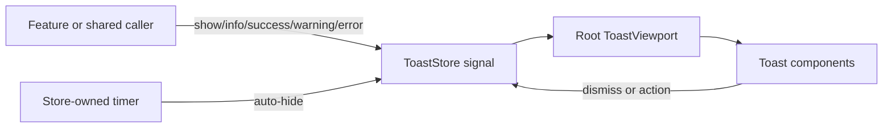

# Toast Notifications

Toast notifications are app-wide transient messages rendered by one `ToastViewport` in the root application shell. Callers inject `ToastStore`; they do not create viewport or toast components directly. The store owns ordered signal state and every auto-hide timer, while the `Toast` component owns visual semantics and user controls.

```typescript
import { ToastStore } from '@msh-shared/services/toast-store';
import { inject } from '@angular/core';

const toastStore = inject(ToastStore);

toastStore.success({
  title: 'movieEditor.toasts.saveSuccessTitle',
  message: 'movieEditor.toasts.saveSuccessMessage',
});
```



Contracts:

- Supported types are `info`, `success`, `warning`, and `error`; each maps to dedicated light and dark semantic color tokens.
- `show()` accepts a required `title` plus optional `message`, `type`, `closable`, `autoHide`, `delay`, and `action`.
- Toast title, message, and action-label strings are passed through `TranslatePipe` at render time. Callers may supply translation keys; already translated or literal copy remains unchanged because missing-key fallback returns the input string.
- `info()`, `success()`, `warning()`, and `error()` are typed convenience methods over `show()`.
- Toasts are closable and auto-hide by default. Callers set `autoHide: false` only for intentionally persistent notifications; closability remains independently configurable.
- `ToastStore` owns standard timing policy through `TOAST_AUTO_HIDE_DELAY_MS`: success feedback uses `2,500` ms, error feedback uses `5,000` ms, and info/warning use the `5,000` ms default. Feature callers omit both `autoHide` and `delay` unless they intentionally override policy.
- A positive finite custom delay is used unchanged. An absent, non-finite, zero, or negative delay falls back to the configured value for the toast type.
- `show()` returns a numeric `ToastId`; `dismiss(id)` is idempotent and `clear()` removes all notifications.
- Activating an optional action invokes its handler and dismisses the toast, including when the handler throws.
- `ToastStore` cancels associated timers on manual dismissal, clear, and service destruction.
- Toast order is oldest to newest in DOM order, which places the newest notification at the bottom of the fixed bottom-right stack.
- Info and success use `role="status"`; warning and error use `role="alert"`. Toast contents are atomic announcements.
- Enter and leave behavior uses Angular's native `animate.enter` and `animate.leave` CSS API and honors reduced-motion preferences.
- The viewport uses the toast z-index token, safe-area insets, a 28 rem maximum width, and a responsive viewport-relative width.
- Every completed URL-driven Movies load uses localized success or error toasts; these auto-hide after 2.5 and 5 seconds respectively. Loading and error state also remain visible in-page, and unchanged query parameters do not trigger background requests.
- Route-driven movie-detail loads use the same 2.5-second success and 5-second error durations. Detail failures retain an in-page error with Retry and Back to movies actions.
- Entering Settings reports the current cached or newly completed settings load. Initial success, retry success, initial error, and retry error all use localized toast feedback while the page retains its loading/error/retry presentation.
- Movie editor load, autofill, save, and movie deletion flows use localized toast feedback. Full autofill is success, optional-enrichment loss is warning, and failed base autofill/save/delete requests are errors. An add-mode duplicate-name `409 Conflict` has dedicated localized title/message copy and keeps the editor draft in place.
- Successful sign-in and sign-out use localized success toasts; a rejected key, malformed authentication response, or invalid/expired returned JWT uses the localized sign-in error toast without exposing the key or token.

Rationale and lessons:

- Timer ownership stays beside state ownership so every removal path can cancel pending work.
- The global viewport avoids feature-level stacking conflicts and preserves notifications during route changes.
- Translating in the toast component prevents raw translation keys when a caller stores keys directly and keeps transient copy reactive to the active language.
- Auto-hide is the centralized default, keeping ordinary feature calls concise and consistent while preserving explicit persistent/custom-duration overrides.
- The implementation adapts Figma node `32:560` geometry and elevation while using MediaShelf semantic tokens instead of raw component colors.

Related lodes: [authentication](../auth/summary.md), [UI summary](summary.md), [design tokens](design-tokens.md), [application shell](application-shell.md), [project practices](../practices.md).
